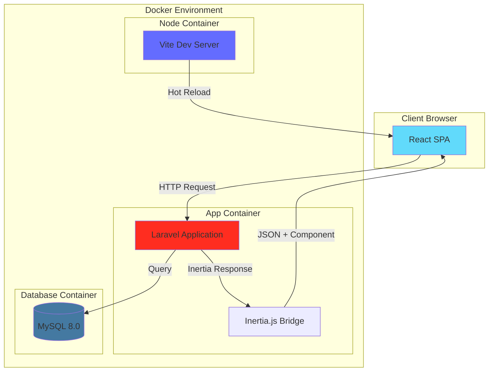
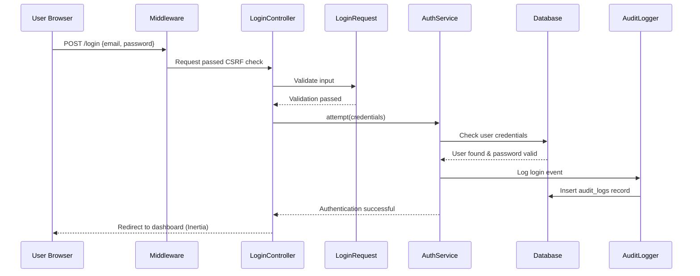
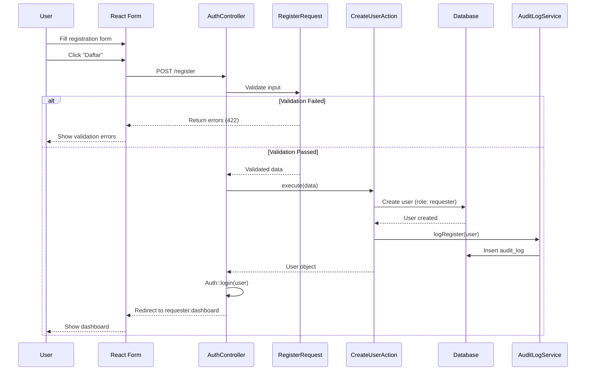
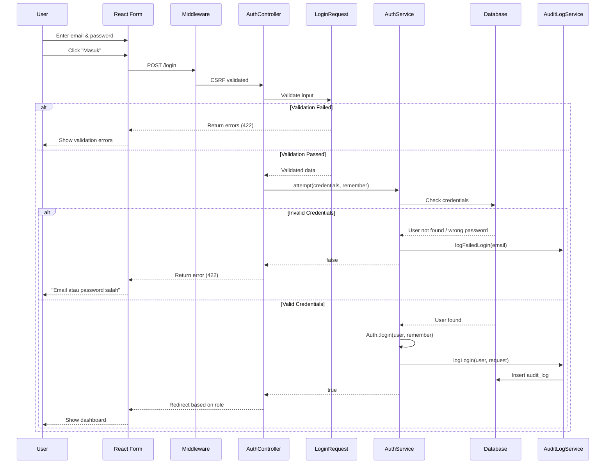
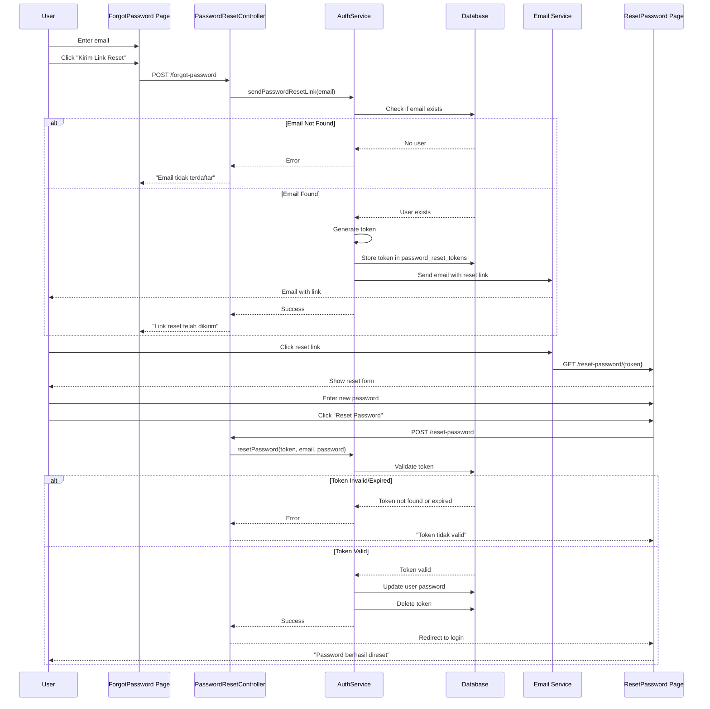
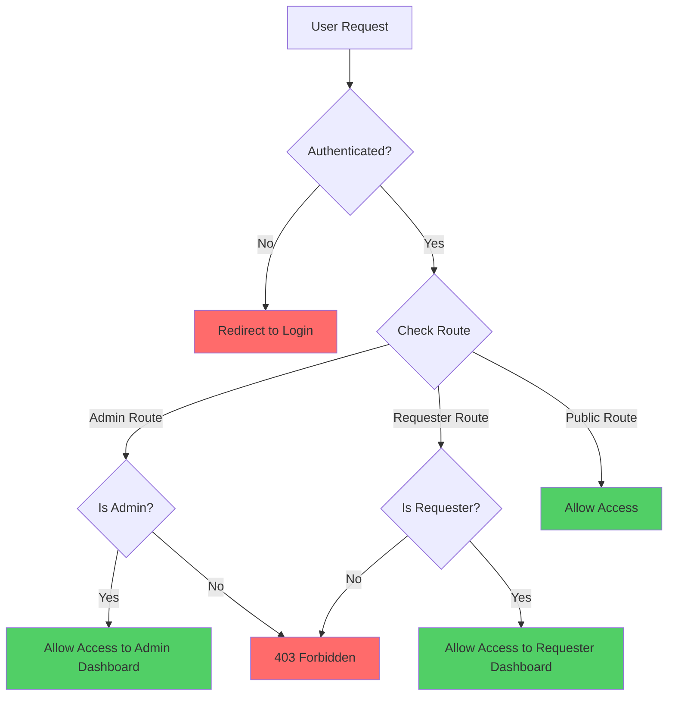

# Design Document: Authentication System

## Overview

Design document ini menjelaskan arsitektur teknis dan implementasi detail untuk sistem authentication yang akan dibangun menggunakan Laravel 11 + Inertia.js + React (JavaScript/JSX) dengan MySQL database, di-deploy menggunakan Docker containers.

Sistem ini merupakan fondasi untuk aplikasi approval surat ijin mall di Bali, yang akan mendukung dua role utama: **Admin** (yang approve/reject surat) dan **Requester** (vendor yang mengajukan surat). Pada fase ini, fokus adalah membangun infrastruktur development yang solid dan mekanisme authentication yang robust dengan role-based access control.

### Tujuan Utama

1. **Development Environment yang Konsisten**: Menggunakan Docker untuk memastikan semua developer bekerja di environment yang sama tanpa perlu instalasi lokal PHP/Composer/MySQL
2. **Authentication yang Aman**: Implementasi login, register, logout, dan password reset dengan security best practices
3. **Role-Based Access Control**: Memisahkan akses dan fitur berdasarkan role user (Admin vs Requester)
4. **Audit Trail**: Tracking semua aktivitas authentication untuk keperluan security dan compliance
5. **Scalable Architecture**: Struktur kode yang clean dan mudah di-extend untuk fitur approval workflow di fase berikutnya

### Technology Stack

- **Backend**: Laravel 11 (PHP 8.2+)
- **Frontend**: React 18 + Inertia.js (JavaScript/JSX, bukan TypeScript)
- **Styling**: Tailwind CSS
- **Database**: MySQL 8.0
- **Containerization**: Docker + Docker Compose
- **Build Tool**: Vite (default Laravel 11)

### Out of Scope (Fase Berikutnya)

- Approval workflow untuk surat ijin (Loading In, Loading Out, Ijin Kerja)
- File upload dan storage (Cloudflare R2 integration)
- Notifikasi real-time untuk Admin
- Dashboard analytics dan reporting
- User management UI untuk Admin (CRUD users)

## Architecture

### High-Level Architecture




### Docker Architecture

Sistem menggunakan 3 container utama yang saling terhubung melalui Docker network:

1. **app** (Laravel Container)
   - Base image: `php:8.2-fpm`
   - Extensions: PDO, MySQL, GD, Zip, BCMath
   - Volume: `./:/var/www/html` (bind mount untuk development)
   - Port: 8000 (exposed ke host)
   - Menjalankan: PHP-FPM + Nginx

2. **db** (MySQL Container)
   - Base image: `mysql:8.0`
   - Volume: `mysql_data` (named volume untuk persistence)
   - Port: 3306 (exposed ke host untuk debugging)
   - Environment: Database credentials dari .env

3. **node** (Node.js Container)
   - Base image: `node:20-alpine`
   - Volume: `./:/var/www/html` (shared dengan app container)
   - Menjalankan: Vite dev server untuk hot reload
   - Port: 5173 (internal, proxied melalui Laravel)

**Network**: Semua container terhubung melalui custom bridge network `laravel_network` untuk komunikasi internal.

### Application Architecture

Aplikasi mengikuti **MVC pattern dengan Service Layer** untuk memisahkan concerns:

```
┌─────────────────────────────────────────────────────────────┐
│                         Browser                              │
│                    (React Components)                        │
└────────────────────────┬────────────────────────────────────┘
                         │ HTTP Request
                         ▼
┌─────────────────────────────────────────────────────────────┐
│                    Middleware Layer                          │
│  (Authentication, CSRF, Role Check, Audit Logging)          │
└────────────────────────┬────────────────────────────────────┘
                         │
                         ▼
┌─────────────────────────────────────────────────────────────┐
│                     Controllers                              │
│        (Thin - hanya terima request & delegate)             │
└────────────────────────┬────────────────────────────────────┘
                         │
                         ▼
┌─────────────────────────────────────────────────────────────┐
│                  Form Requests                               │
│              (Validation Rules)                              │
└────────────────────────┬────────────────────────────────────┘
                         │
                         ▼
┌─────────────────────────────────────────────────────────────┐
│                Services / Actions                            │
│            (Business Logic Layer)                            │
└────────────────────────┬────────────────────────────────────┘
                         │
                         ▼
┌─────────────────────────────────────────────────────────────┐
│                      Models                                  │
│         (Eloquent ORM + Relationships)                       │
└────────────────────────┬────────────────────────────────────┘
                         │
                         ▼
┌─────────────────────────────────────────────────────────────┐
│                     Database                                 │
│                   (MySQL 8.0)                                │
└─────────────────────────────────────────────────────────────┘
```

### Request Flow Example: User Login



## Components and Interfaces

### Backend Components

#### 1. Controllers (app/Http/Controllers/Auth/)

**AuthController.php**
- Tanggung jawab: Menangani semua authentication requests
- Methods:
  - `showLogin()`: Render halaman login (Inertia)
  - `login(LoginRequest $request)`: Proses login
  - `logout(Request $request)`: Proses logout
  - `showRegister()`: Render halaman register
  - `register(RegisterRequest $request)`: Proses registrasi Requester

**PasswordResetController.php**
- Tanggung jawab: Menangani forgot password dan reset password
- Methods:
  - `showForgotPassword()`: Render halaman forgot password
  - `sendResetLink(ForgotPasswordRequest $request)`: Kirim email reset
  - `showResetPassword(string $token)`: Render halaman reset password
  - `resetPassword(ResetPasswordRequest $request)`: Update password baru

**EmailVerificationController.php** (Opsional untuk MVP)
- Tanggung jawab: Menangani email verification
- Methods:
  - `notice()`: Render halaman "please verify email"
  - `verify(Request $request)`: Proses verifikasi email
  - `resend(Request $request)`: Kirim ulang email verifikasi

#### 2. Form Requests (app/Http/Requests/Auth/)

**LoginRequest.php**
```php
Rules:
- email: required|email
- password: required|string
- remember: boolean
```

**RegisterRequest.php**
```php
Rules:
- name: required|string|max:255
- email: required|email|unique:users,email
- password: required|string|min:8|confirmed
```

**ForgotPasswordRequest.php**
```php
Rules:
- email: required|email|exists:users,email
```

**ResetPasswordRequest.php**
```php
Rules:
- token: required|string
- email: required|email|exists:users,email
- password: required|string|min:8|confirmed
```

#### 3. Services (app/Services/Auth/)

**AuthService.php**
- Tanggung jawab: Business logic untuk authentication
- Methods:
  - `register(array $data): User` - Buat user baru dengan role 'requester'
  - `attempt(array $credentials, bool $remember): bool` - Login user
  - `logout(): void` - Logout user dan hapus session
  - `sendPasswordResetLink(string $email): void` - Generate token & kirim email
  - `resetPassword(array $data): void` - Update password user

**AuditLogService.php**
- Tanggung jawab: Mencatat semua aktivitas authentication
- Methods:
  - `logLogin(User $user, Request $request): void`
  - `logLogout(User $user): void`
  - `logRegister(User $user): void`
  - `logPasswordReset(User $user): void`
  - `logEmailVerification(User $user): void`

#### 4. Models (app/Models/)

**User.php**
- Attributes: id, name, email, password, role, email_verified_at, remember_token, timestamps
- Relationships: `hasMany(AuditLog::class)`
- Scopes: `scopeAdmins()`, `scopeRequesters()`
- Accessors: `isAdmin()`, `isRequester()`
- Mutators: Password auto-hash on set

**AuditLog.php**
- Attributes: id, user_id, user_email, action, ip_address, user_agent, metadata (JSON), timestamps
- Relationships: `belongsTo(User::class)`
- Scopes: `scopeByAction(string $action)`, `scopeByUser(int $userId)`

#### 5. Middleware (app/Http/Middleware/)

**EnsureUserIsAdmin.php**
- Check apakah user memiliki role 'admin'
- Jika tidak, return 403 Forbidden

**EnsureUserIsRequester.php**
- Check apakah user memiliki role 'requester'
- Jika tidak, return 403 Forbidden

**LogAuditTrail.php**
- Middleware global yang log setiap request penting
- Hanya log untuk routes tertentu (login, logout, register, dll)

**EnsureEmailIsVerified.php** (Opsional untuk MVP)
- Check apakah email user sudah diverifikasi
- Jika belum, redirect ke halaman verification notice

#### 6. Policies (app/Policies/)

**UserPolicy.php**
- Methods:
  - `viewAny(User $user): bool` - Hanya admin bisa lihat list users
  - `view(User $user, User $model): bool` - User bisa lihat profile sendiri, admin bisa lihat semua
  - `update(User $user, User $model): bool` - User bisa update profile sendiri, admin bisa update semua
  - `delete(User $user, User $model): bool` - Hanya admin bisa delete user

### Frontend Components

#### 1. Pages (resources/js/Pages/)

**Auth/Login.jsx**
- Props: `errors` (validation errors), `status` (flash message)
- Form fields: email, password, remember
- Submit: POST ke `/login`

**Auth/Register.jsx**
- Props: `errors`
- Form fields: name, email, password, password_confirmation
- Submit: POST ke `/register`

**Auth/ForgotPassword.jsx**
- Props: `errors`, `status`
- Form field: email
- Submit: POST ke `/forgot-password`

**Auth/ResetPassword.jsx**
- Props: `token`, `email`, `errors`
- Form fields: password, password_confirmation
- Submit: POST ke `/reset-password`

**Auth/VerifyEmail.jsx** (Opsional)
- Props: `status`
- Tampilkan pesan "Please verify your email"
- Tombol "Resend Verification Email"

**Dashboard/AdminDashboard.jsx**
- Props: `auth` (user object)
- Tampilan: Welcome message, navigation ke fitur admin

**Dashboard/RequesterDashboard.jsx**
- Props: `auth` (user object)
- Tampilan: Welcome message, navigation ke fitur requester

#### 2. Layouts (resources/js/Layouts/)

**GuestLayout.jsx**
- Digunakan untuk: Login, Register, Forgot Password, Reset Password
- Struktur: Centered card dengan logo, form, dan footer links
- Styling: Clean, minimal, responsive

**AuthenticatedLayout.jsx**
- Digunakan untuk: Dashboard dan semua halaman setelah login
- Struktur: Navbar (dengan user menu & logout), sidebar (navigation), main content area
- Props: `auth` (user object untuk tampilkan nama & role)
- Responsive: Collapsible sidebar di mobile

#### 3. Components (resources/js/Components/)

**ui/Button.jsx**
- Props: `type`, `className`, `disabled`, `children`, `onClick`
- Variants: primary, secondary, danger
- States: normal, loading, disabled

**ui/Input.jsx**
- Props: `type`, `name`, `value`, `onChange`, `error`, `label`, `placeholder`, `required`
- Tampilkan error message di bawah input jika ada

**ui/Label.jsx**
- Props: `htmlFor`, `children`, `required`
- Tampilkan asterisk (*) jika required

**ui/Alert.jsx**
- Props: `type` (success, error, warning, info), `message`
- Digunakan untuk flash messages

**shared/ValidationErrors.jsx**
- Props: `errors` (object dari Inertia)
- Render list of validation errors

**shared/FlashMessage.jsx**
- Props: `message`, `type`
- Auto-dismiss setelah 5 detik

**shared/UserMenu.jsx**
- Props: `user`
- Dropdown menu: Profile, Settings, Logout
- Tampilkan nama user dan role

#### 4. Hooks (resources/js/hooks/)

**useAuth.js**
- Return: `{ user, isAdmin, isRequester, logout }`
- Mengambil data user dari Inertia shared props
- Helper functions untuk check role

**useFlashMessage.js**
- Return: `{ message, type, show, hide }`
- Manage flash message state
- Auto-hide setelah duration tertentu

#### 5. Utils (resources/js/utils/)

**api.js**
- Helper functions untuk Inertia router
- `post()`, `put()`, `delete()` dengan error handling

**validation.js**
- Client-side validation helpers
- `isValidEmail()`, `isStrongPassword()`, dll

## Data Models

### Database Schema

#### Table: users

```sql
CREATE TABLE users (
    id BIGINT UNSIGNED AUTO_INCREMENT PRIMARY KEY,
    name VARCHAR(255) NOT NULL,
    email VARCHAR(255) NOT NULL UNIQUE,
    password VARCHAR(255) NOT NULL,
    role ENUM('admin', 'requester') NOT NULL DEFAULT 'requester',
    email_verified_at TIMESTAMP NULL,
    remember_token VARCHAR(100) NULL,
    created_at TIMESTAMP NULL,
    updated_at TIMESTAMP NULL,
    
    INDEX idx_email (email),
    INDEX idx_role (role)
) ENGINE=InnoDB DEFAULT CHARSET=utf8mb4 COLLATE=utf8mb4_unicode_ci;
```

**Kolom Explanation:**
- `id`: Primary key, auto-increment
- `name`: Nama lengkap user
- `email`: Email user, unique constraint untuk prevent duplicate
- `password`: Hashed password menggunakan bcrypt
- `role`: ENUM untuk role-based access (admin atau requester)
- `email_verified_at`: Timestamp kapan email diverifikasi (NULL jika belum)
- `remember_token`: Token untuk "Remember Me" functionality
- `created_at`, `updated_at`: Laravel timestamps

**Indexes:**
- `idx_email`: Untuk optimasi query login (WHERE email = ?)
- `idx_role`: Untuk optimasi query filter by role

#### Table: password_reset_tokens

```sql
CREATE TABLE password_reset_tokens (
    email VARCHAR(255) NOT NULL PRIMARY KEY,
    token VARCHAR(255) NOT NULL,
    created_at TIMESTAMP NULL,
    
    INDEX idx_token (token)
) ENGINE=InnoDB DEFAULT CHARSET=utf8mb4 COLLATE=utf8mb4_unicode_ci;
```

**Kolom Explanation:**
- `email`: Email user yang request reset (primary key)
- `token`: Hashed token untuk verifikasi reset link
- `created_at`: Timestamp untuk check expiry (60 menit)

**Note**: Laravel default menggunakan table ini, bukan `password_resets` seperti versi lama.

#### Table: audit_logs

```sql
CREATE TABLE audit_logs (
    id BIGINT UNSIGNED AUTO_INCREMENT PRIMARY KEY,
    user_id BIGINT UNSIGNED NULL,
    user_email VARCHAR(255) NOT NULL,
    action VARCHAR(50) NOT NULL,
    ip_address VARCHAR(45) NULL,
    user_agent TEXT NULL,
    metadata JSON NULL,
    created_at TIMESTAMP NULL,
    updated_at TIMESTAMP NULL,
    
    INDEX idx_user_id (user_id),
    INDEX idx_action (action),
    INDEX idx_created_at (created_at),
    
    FOREIGN KEY (user_id) REFERENCES users(id) ON DELETE SET NULL
) ENGINE=InnoDB DEFAULT CHARSET=utf8mb4 COLLATE=utf8mb4_unicode_ci;
```

**Kolom Explanation:**
- `id`: Primary key
- `user_id`: Foreign key ke users table (NULL jika user dihapus)
- `user_email`: Email user (disimpan terpisah untuk history jika user dihapus)
- `action`: Jenis aktivitas (login, logout, register, password_reset, email_verification)
- `ip_address`: IP address user saat melakukan action
- `user_agent`: Browser/device information
- `metadata`: JSON field untuk data tambahan (contoh: failed login reason, dll)
- `created_at`, `updated_at`: Laravel timestamps

**Indexes:**
- `idx_user_id`: Untuk query "show all logs by user"
- `idx_action`: Untuk query "show all login attempts"
- `idx_created_at`: Untuk query "show logs in date range"

#### Table: sessions (Laravel default)

```sql
CREATE TABLE sessions (
    id VARCHAR(255) NOT NULL PRIMARY KEY,
    user_id BIGINT UNSIGNED NULL,
    ip_address VARCHAR(45) NULL,
    user_agent TEXT NULL,
    payload LONGTEXT NOT NULL,
    last_activity INT NOT NULL,
    
    INDEX idx_user_id (user_id),
    INDEX idx_last_activity (last_activity)
) ENGINE=InnoDB DEFAULT CHARSET=utf8mb4 COLLATE=utf8mb4_unicode_ci;
```

**Note**: Table ini digunakan jika session driver = database (recommended untuk production).

### Entity Relationship Diagram

```mermaid
erDiagram
    USERS ||--o{ AUDIT_LOGS : "has many"
    USERS ||--o| PASSWORD_RESET_TOKENS : "has one"
    USERS ||--o{ SESSIONS : "has many"
    
    USERS {
        bigint id PK
        string name
        string email UK
        string password
        enum role
        timestamp email_verified_at
        string remember_token
        timestamps
    }
    
    AUDIT_LOGS {
        bigint id PK
        bigint user_id FK
        string user_email
        string action
        string ip_address
        text user_agent
        json metadata
        timestamps
    }
    
    PASSWORD_RESET_TOKENS {
        string email PK
        string token
        timestamp created_at
    }
    
    SESSIONS {
        string id PK
        bigint user_id FK
        string ip_address
        text user_agent
        longtext payload
        int last_activity
    }
```

### Model Relationships

**User Model:**
```php
// One-to-Many: User has many audit logs
public function auditLogs(): HasMany
{
    return $this->hasMany(AuditLog::class);
}

// One-to-Many: User has many sessions
public function sessions(): HasMany
{
    return $this->hasMany(Session::class);
}
```

**AuditLog Model:**
```php
// Many-to-One: Audit log belongs to user
public function user(): BelongsTo
{
    return $this->belongsTo(User::class);
}
```

### Data Seeding Strategy

**AdminSeeder.php:**
```php
// Buat 1 akun admin default untuk testing
User::create([
    'name' => 'Admin Mall',
    'email' => 'admin@mall.com',
    'password' => Hash::make('password123'),
    'role' => 'admin',
    'email_verified_at' => now(),
]);
```

**RequesterSeeder.php** (Opsional, untuk testing):
```php
// Buat 3-5 akun requester dummy untuk testing
User::factory()->count(5)->create([
    'role' => 'requester',
    'email_verified_at' => now(),
]);
```

## Error Handling

### Validation Errors

**Backend (Form Request):**
- Semua validasi dilakukan di Form Request class
- Return 422 Unprocessable Entity dengan error details
- Format error: `{ "email": ["The email field is required."] }`

**Frontend (React):**
- Inertia otomatis passing errors ke component via props
- Tampilkan error message di bawah setiap input field
- Highlight input field yang error dengan border merah

### Authentication Errors

**Invalid Credentials:**
- Status: 422 Unprocessable Entity
- Message: "Email atau password salah"
- Tidak spesifik apakah email atau password yang salah (security best practice)

**Unauthorized Access:**
- Status: 401 Unauthorized
- Redirect ke halaman login
- Flash message: "Silakan login terlebih dahulu"

**Forbidden Access (Role Mismatch):**
- Status: 403 Forbidden
- Render halaman error 403 dengan message: "Anda tidak memiliki akses ke halaman ini"
- Tombol "Kembali ke Dashboard"

### Password Reset Errors

**Email Not Found:**
- Status: 422 Unprocessable Entity
- Message: "Email tidak terdaftar di sistem"

**Token Invalid/Expired:**
- Status: 422 Unprocessable Entity
- Message: "Link reset password tidak valid atau sudah kadaluarsa"
- Redirect ke halaman forgot password dengan link "Kirim ulang link reset"

### Rate Limiting

**Login Attempts:**
- Limit: 5 attempts per 1 menit per IP address
- Setelah limit: Return 429 Too Many Requests
- Message: "Terlalu banyak percobaan login. Silakan coba lagi dalam 1 menit."

**Password Reset Requests:**
- Limit: 3 requests per 1 jam per email
- Setelah limit: Return 429 Too Many Requests
- Message: "Terlalu banyak permintaan reset password. Silakan coba lagi nanti."

### Error Logging

**Application Errors:**
- Log ke `storage/logs/laravel.log`
- Include: timestamp, error message, stack trace, request data (tanpa password)

**Audit Trail:**
- Log failed login attempts ke audit_logs table
- Metadata: `{ "reason": "invalid_credentials", "email": "user@example.com" }`

### User-Friendly Error Pages

**404 Not Found:**
- Custom page dengan message: "Halaman tidak ditemukan"
- Link kembali ke dashboard

**403 Forbidden:**
- Custom page dengan message: "Anda tidak memiliki akses"
- Link kembali ke dashboard

**500 Server Error:**
- Custom page dengan message: "Terjadi kesalahan. Tim kami sudah diberitahu."
- Jangan expose stack trace di production

## Testing Strategy

### Testing Approach

Untuk authentication system ini, testing strategy akan fokus pada **example-based unit tests** dan **integration tests**. Property-based testing (PBT) **tidak applicable** untuk sebagian besar fitur karena:

1. **Infrastructure Setup (Docker)**: Ini adalah konfigurasi, bukan logic yang bisa di-test dengan properties
2. **CRUD Operations**: User registration dan management adalah operasi sederhana tanpa transformation logic yang kompleks
3. **UI Rendering**: React components untuk authentication adalah presentational, lebih cocok dengan snapshot tests
4. **Authentication Flow**: Login/logout adalah side-effect operations yang lebih cocok dengan integration tests

**Testing akan dibagi menjadi:**

### 1. Unit Tests (PHPUnit)

**Target**: Service classes, helper functions, dan business logic

**AuthService Tests:**
```php
// Test cases:
- test_register_creates_user_with_requester_role()
- test_register_hashes_password()
- test_attempt_returns_true_for_valid_credentials()
- test_attempt_returns_false_for_invalid_credentials()
- test_logout_clears_session()
```

**AuditLogService Tests:**
```php
// Test cases:
- test_log_login_creates_audit_record()
- test_log_logout_creates_audit_record()
- test_log_includes_ip_and_user_agent()
```

**Validation Tests:**
```php
// Test cases:
- test_login_requires_email_and_password()
- test_register_requires_all_fields()
- test_register_validates_email_format()
- test_register_validates_password_min_length()
- test_register_validates_password_confirmation()
- test_register_validates_email_uniqueness()
```

### 2. Feature Tests (PHPUnit)

**Target**: End-to-end authentication flows

**Authentication Flow Tests:**
```php
// Test cases:
- test_user_can_view_login_page()
- test_user_can_login_with_valid_credentials()
- test_user_cannot_login_with_invalid_credentials()
- test_user_is_redirected_to_correct_dashboard_based_on_role()
- test_user_can_logout()
- test_guest_cannot_access_protected_routes()
```

**Registration Flow Tests:**
```php
// Test cases:
- test_user_can_view_registration_page()
- test_user_can_register_as_requester()
- test_user_cannot_register_with_duplicate_email()
- test_user_is_auto_logged_in_after_registration()
- test_registration_only_creates_requester_role()
```

**Password Reset Flow Tests:**
```php
// Test cases:
- test_user_can_request_password_reset()
- test_password_reset_email_is_sent()
- test_user_can_reset_password_with_valid_token()
- test_user_cannot_reset_password_with_invalid_token()
- test_password_reset_token_expires_after_60_minutes()
```

**Role-Based Access Tests:**
```php
// Test cases:
- test_admin_can_access_admin_routes()
- test_requester_cannot_access_admin_routes()
- test_requester_can_access_requester_routes()
- test_admin_cannot_access_requester_routes()
```

**Audit Trail Tests:**
```php
// Test cases:
- test_login_creates_audit_log()
- test_logout_creates_audit_log()
- test_registration_creates_audit_log()
- test_password_reset_creates_audit_log()
- test_audit_log_includes_user_info_and_timestamp()
```

### 3. Integration Tests

**Target**: Database interactions, email sending, session management

**Database Integration:**
```php
// Test cases:
- test_user_is_persisted_to_database()
- test_password_is_hashed_in_database()
- test_audit_log_is_persisted_to_database()
- test_password_reset_token_is_persisted()
```

**Email Integration:**
```php
// Test cases:
- test_password_reset_email_is_sent_to_correct_address()
- test_email_verification_email_is_sent() // jika diaktifkan
```

**Session Integration:**
```php
// Test cases:
- test_session_is_created_on_login()
- test_session_is_destroyed_on_logout()
- test_remember_me_creates_persistent_session()
```

### 4. Component Tests (React Testing Library)

**Target**: React components behavior dan user interactions

**Login Component Tests:**
```jsx
// Test cases:
- renders login form with email and password fields
- shows validation errors when fields are empty
- disables submit button while processing
- calls login endpoint with correct data
- redirects to dashboard on successful login
```

**Register Component Tests:**
```jsx
// Test cases:
- renders registration form with all required fields
- validates email format on blur
- validates password strength
- validates password confirmation match
- shows success message on successful registration
```

**Dashboard Component Tests:**
```jsx
// Test cases:
- renders admin dashboard for admin users
- renders requester dashboard for requester users
- displays user name and role
- shows logout button
```

### 5. Browser Tests (Laravel Dusk) - Opsional

**Target**: Full end-to-end user flows di real browser

```php
// Test cases:
- test_complete_registration_and_login_flow()
- test_complete_password_reset_flow()
- test_navigation_between_pages()
```

### Test Coverage Goals

- **Unit Tests**: 80%+ coverage untuk Services dan Actions
- **Feature Tests**: 100% coverage untuk authentication flows
- **Component Tests**: 70%+ coverage untuk critical UI components

### Testing Tools

- **Backend**: PHPUnit (included dengan Laravel)
- **Frontend**: Vitest + React Testing Library
- **Browser**: Laravel Dusk (opsional)
- **Mocking**: Mockery (backend), MSW (frontend)

### CI/CD Integration

Tests akan dijalankan otomatis di CI/CD pipeline:
1. Run PHPUnit tests
2. Run Vitest tests
3. Generate coverage report
4. Fail build jika coverage < threshold

### Manual Testing Checklist

Setelah implementation, manual testing untuk:
- [ ] Login dengan kredensial valid
- [ ] Login dengan kredensial invalid
- [ ] Register akun baru
- [ ] Logout
- [ ] Forgot password flow
- [ ] Reset password dengan token valid
- [ ] Reset password dengan token expired
- [ ] Access admin route sebagai requester (should fail)
- [ ] Access requester route sebagai admin (should fail)
- [ ] Check audit logs di database
- [ ] Responsive design di mobile
- [ ] Browser compatibility (Chrome, Firefox, Safari)

---

**Note**: Karena authentication system ini lebih fokus pada infrastructure setup, CRUD operations, dan UI rendering, property-based testing tidak memberikan value yang signifikan. Testing strategy di atas sudah cukup comprehensive untuk memastikan sistem berfungsi dengan benar dan aman.


## Implementation Details

### Docker Configuration

#### docker-compose.yml

```yaml
version: '3.8'

services:
  # Laravel Application Container
  app:
    build:
      context: .
      dockerfile: Dockerfile
    container_name: laravel_app
    restart: unless-stopped
    working_dir: /var/www/html
    volumes:
      - ./:/var/www/html
      - ./docker/php/local.ini:/usr/local/etc/php/conf.d/local.ini
    ports:
      - "8000:8000"
    networks:
      - laravel_network
    depends_on:
      - db
    environment:
      - DB_HOST=db
      - DB_PORT=3306
      - DB_DATABASE=${DB_DATABASE}
      - DB_USERNAME=${DB_USERNAME}
      - DB_PASSWORD=${DB_PASSWORD}
    command: php artisan serve --host=0.0.0.0 --port=8000

  # MySQL Database Container
  db:
    image: mysql:8.0
    container_name: laravel_db
    restart: unless-stopped
    environment:
      MYSQL_DATABASE: ${DB_DATABASE}
      MYSQL_ROOT_PASSWORD: ${DB_PASSWORD}
      MYSQL_PASSWORD: ${DB_PASSWORD}
      MYSQL_USER: ${DB_USERNAME}
    volumes:
      - mysql_data:/var/lib/mysql
    ports:
      - "3306:3306"
    networks:
      - laravel_network

  # Node.js Container untuk Vite
  node:
    image: node:20-alpine
    container_name: laravel_node
    working_dir: /var/www/html
    volumes:
      - ./:/var/www/html
    ports:
      - "5173:5173"
    networks:
      - laravel_network
    command: sh -c "npm install && npm run dev -- --host"

volumes:
  mysql_data:
    driver: local

networks:
  laravel_network:
    driver: bridge
```

#### Dockerfile

```dockerfile
FROM php:8.2-fpm

# Install system dependencies
RUN apt-get update && apt-get install -y \
    git \
    curl \
    libpng-dev \
    libonig-dev \
    libxml2-dev \
    zip \
    unzip \
    nginx

# Clear cache
RUN apt-get clean && rm -rf /var/lib/apt/lists/*

# Install PHP extensions
RUN docker-php-ext-install pdo_mysql mbstring exif pcntl bcmath gd

# Get latest Composer
COPY --from=composer:latest /usr/bin/composer /usr/bin/composer

# Set working directory
WORKDIR /var/www/html

# Copy existing application directory
COPY . /var/www/html

# Install dependencies
RUN composer install --no-interaction --optimize-autoloader --no-dev

# Set permissions
RUN chown -R www-data:www-data /var/www/html/storage /var/www/html/bootstrap/cache

# Expose port 8000
EXPOSE 8000

CMD ["php", "artisan", "serve", "--host=0.0.0.0", "--port=8000"]
```

#### .env.example

```env
APP_NAME="Mall Approval System"
APP_ENV=local
APP_KEY=
APP_DEBUG=true
APP_URL=http://localhost:8000

LOG_CHANNEL=stack
LOG_DEPRECATIONS_CHANNEL=null
LOG_LEVEL=debug

DB_CONNECTION=mysql
DB_HOST=db
DB_PORT=3306
DB_DATABASE=mall_approval
DB_USERNAME=mall_user
DB_PASSWORD=secret123

BROADCAST_DRIVER=log
CACHE_DRIVER=file
FILESYSTEM_DISK=local
QUEUE_CONNECTION=sync
SESSION_DRIVER=database
SESSION_LIFETIME=120

MAIL_MAILER=log
MAIL_HOST=mailpit
MAIL_PORT=1025
MAIL_USERNAME=null
MAIL_PASSWORD=null
MAIL_ENCRYPTION=null
MAIL_FROM_ADDRESS="noreply@mall.com"
MAIL_FROM_NAME="${APP_NAME}"

# Email Verification (set to false untuk skip di MVP)
EMAIL_VERIFICATION_ENABLED=false
```

### Laravel File Structure

```
laravel-app/
├── app/
│   ├── Actions/
│   │   └── Auth/
│   │       ├── CreateUserAction.php
│   │       ├── LoginUserAction.php
│   │       ├── LogoutUserAction.php
│   │       └── ResetPasswordAction.php
│   ├── Http/
│   │   ├── Controllers/
│   │   │   └── Auth/
│   │   │       ├── AuthController.php
│   │   │       ├── PasswordResetController.php
│   │   │       └── EmailVerificationController.php
│   │   ├── Middleware/
│   │   │   ├── EnsureUserIsAdmin.php
│   │   │   ├── EnsureUserIsRequester.php
│   │   │   ├── LogAuditTrail.php
│   │   │   └── EnsureEmailIsVerified.php
│   │   └── Requests/
│   │       └── Auth/
│   │           ├── LoginRequest.php
│   │           ├── RegisterRequest.php
│   │           ├── ForgotPasswordRequest.php
│   │           └── ResetPasswordRequest.php
│   ├── Models/
│   │   ├── User.php
│   │   └── AuditLog.php
│   ├── Policies/
│   │   └── UserPolicy.php
│   └── Services/
│       └── Auth/
│           ├── AuthService.php
│           └── AuditLogService.php
├── database/
│   ├── migrations/
│   │   ├── 2024_01_01_000001_create_users_table.php
│   │   ├── 2024_01_01_000002_create_password_reset_tokens_table.php
│   │   ├── 2024_01_01_000003_create_sessions_table.php
│   │   └── 2024_01_01_000004_create_audit_logs_table.php
│   ├── seeders/
│   │   ├── DatabaseSeeder.php
│   │   ├── AdminSeeder.php
│   │   └── RequesterSeeder.php
│   └── factories/
│       └── UserFactory.php
├── resources/
│   ├── js/
│   │   ├── Components/
│   │   │   ├── ui/
│   │   │   │   ├── Button.jsx
│   │   │   │   ├── Input.jsx
│   │   │   │   ├── Label.jsx
│   │   │   │   └── Alert.jsx
│   │   │   └── shared/
│   │   │       ├── ValidationErrors.jsx
│   │   │       ├── FlashMessage.jsx
│   │   │       └── UserMenu.jsx
│   │   ├── Layouts/
│   │   │   ├── GuestLayout.jsx
│   │   │   └── AuthenticatedLayout.jsx
│   │   ├── Pages/
│   │   │   ├── Auth/
│   │   │   │   ├── Login.jsx
│   │   │   │   ├── Register.jsx
│   │   │   │   ├── ForgotPassword.jsx
│   │   │   │   ├── ResetPassword.jsx
│   │   │   │   └── VerifyEmail.jsx
│   │   │   └── Dashboard/
│   │   │       ├── AdminDashboard.jsx
│   │   │       └── RequesterDashboard.jsx
│   │   ├── hooks/
│   │   │   ├── useAuth.js
│   │   │   └── useFlashMessage.js
│   │   ├── utils/
│   │   │   ├── api.js
│   │   │   └── validation.js
│   │   └── app.jsx
│   └── views/
│       └── app.blade.php
├── routes/
│   └── web.php
├── tests/
│   ├── Feature/
│   │   └── Auth/
│   │       ├── LoginTest.php
│   │       ├── RegisterTest.php
│   │       ├── PasswordResetTest.php
│   │       └── RoleBasedAccessTest.php
│   └── Unit/
│       └── Services/
│           ├── AuthServiceTest.php
│           └── AuditLogServiceTest.php
├── docker-compose.yml
├── Dockerfile
├── .env.example
└── README.md
```

### React File Structure Detail

```
resources/js/
├── Components/
│   ├── ui/                          # Komponen primitif reusable
│   │   ├── Button.jsx               # Tombol dengan variants (primary, secondary, danger)
│   │   ├── Input.jsx                # Input field dengan label dan error handling
│   │   ├── Label.jsx                # Label dengan required indicator
│   │   ├── Alert.jsx                # Alert box untuk messages
│   │   ├── Card.jsx                 # Card container
│   │   └── Spinner.jsx              # Loading spinner
│   └── shared/                      # Komponen shared antar pages
│       ├── ValidationErrors.jsx     # Display validation errors
│       ├── FlashMessage.jsx         # Flash message dengan auto-dismiss
│       ├── UserMenu.jsx             # Dropdown menu user
│       └── Logo.jsx                 # Logo aplikasi
├── Layouts/
│   ├── GuestLayout.jsx              # Layout untuk guest (login, register)
│   └── AuthenticatedLayout.jsx     # Layout untuk authenticated users
├── Pages/
│   ├── Auth/
│   │   ├── Login.jsx                # Halaman login
│   │   ├── Register.jsx             # Halaman register
│   │   ├── ForgotPassword.jsx       # Halaman forgot password
│   │   ├── ResetPassword.jsx        # Halaman reset password
│   │   └── VerifyEmail.jsx          # Halaman verify email (opsional)
│   └── Dashboard/
│       ├── AdminDashboard.jsx       # Dashboard untuk admin
│       └── RequesterDashboard.jsx   # Dashboard untuk requester
├── hooks/
│   ├── useAuth.js                   # Hook untuk authentication state
│   └── useFlashMessage.js           # Hook untuk flash messages
├── utils/
│   ├── api.js                       # Helper untuk Inertia requests
│   └── validation.js                # Client-side validation helpers
└── app.jsx                          # Entry point Inertia
```

### Routing Structure

#### routes/web.php

```php
<?php

use App\Http\Controllers\Auth\AuthController;
use App\Http\Controllers\Auth\PasswordResetController;
use App\Http\Controllers\Auth\EmailVerificationController;
use Illuminate\Support\Facades\Route;

/*
|--------------------------------------------------------------------------
| Guest Routes (Tidak perlu login)
|--------------------------------------------------------------------------
*/

Route::middleware('guest')->group(function () {
    // Login
    Route::get('/login', [AuthController::class, 'showLogin'])->name('login');
    Route::post('/login', [AuthController::class, 'login']);
    
    // Register
    Route::get('/register', [AuthController::class, 'showRegister'])->name('register');
    Route::post('/register', [AuthController::class, 'register']);
    
    // Forgot Password
    Route::get('/forgot-password', [PasswordResetController::class, 'showForgotPassword'])
        ->name('password.request');
    Route::post('/forgot-password', [PasswordResetController::class, 'sendResetLink'])
        ->name('password.email');
    
    // Reset Password
    Route::get('/reset-password/{token}', [PasswordResetController::class, 'showResetPassword'])
        ->name('password.reset');
    Route::post('/reset-password', [PasswordResetController::class, 'resetPassword'])
        ->name('password.update');
});

/*
|--------------------------------------------------------------------------
| Authenticated Routes (Perlu login)
|--------------------------------------------------------------------------
*/

Route::middleware('auth')->group(function () {
    // Logout
    Route::post('/logout', [AuthController::class, 'logout'])->name('logout');
    
    // Email Verification (opsional)
    Route::get('/email/verify', [EmailVerificationController::class, 'notice'])
        ->name('verification.notice');
    Route::get('/email/verify/{id}/{hash}', [EmailVerificationController::class, 'verify'])
        ->middleware('signed')
        ->name('verification.verify');
    Route::post('/email/verification-notification', [EmailVerificationController::class, 'resend'])
        ->middleware('throttle:6,1')
        ->name('verification.send');
});

/*
|--------------------------------------------------------------------------
| Admin Routes (Perlu login + role admin)
|--------------------------------------------------------------------------
*/

Route::middleware(['auth', 'role:admin'])->prefix('admin')->name('admin.')->group(function () {
    Route::get('/dashboard', function () {
        return Inertia::render('Dashboard/AdminDashboard');
    })->name('dashboard');
    
    // Future: User management, approval management, reports, dll
});

/*
|--------------------------------------------------------------------------
| Requester Routes (Perlu login + role requester)
|--------------------------------------------------------------------------
*/

Route::middleware(['auth', 'role:requester'])->prefix('requester')->name('requester.')->group(function () {
    Route::get('/dashboard', function () {
        return Inertia::render('Dashboard/RequesterDashboard');
    })->name('dashboard');
    
    // Future: Create request, view request status, dll
});

/*
|--------------------------------------------------------------------------
| Redirect Root
|--------------------------------------------------------------------------
*/

Route::get('/', function () {
    if (auth()->check()) {
        return redirect()->route(auth()->user()->isAdmin() ? 'admin.dashboard' : 'requester.dashboard');
    }
    return redirect()->route('login');
});
```

### Middleware Chain

#### Authentication Flow Middleware

```
Request → StartSession → CSRF → Authenticate → RoleCheck → LogAudit → Controller
```

**Penjelasan:**
1. **StartSession**: Mulai session untuk user
2. **CSRF**: Validasi CSRF token untuk form submission
3. **Authenticate**: Check apakah user sudah login
4. **RoleCheck**: Check apakah user punya role yang sesuai (admin/requester)
5. **LogAudit**: Log aktivitas ke audit_logs table
6. **Controller**: Proses request di controller

#### Middleware Registration (app/Http/Kernel.php)

```php
protected $middlewareAliases = [
    'auth' => \App\Http\Middleware\Authenticate::class,
    'role' => \App\Http\Middleware\CheckRole::class,
    'audit' => \App\Http\Middleware\LogAuditTrail::class,
    'verified' => \App\Http\Middleware\EnsureEmailIsVerified::class,
];

protected $middlewareGroups = [
    'web' => [
        \App\Http\Middleware\EncryptCookies::class,
        \Illuminate\Cookie\Middleware\AddQueuedCookiesToResponse::class,
        \Illuminate\Session\Middleware\StartSession::class,
        \Illuminate\View\Middleware\ShareErrorsFromSession::class,
        \App\Http\Middleware\VerifyCsrfToken::class,
        \Illuminate\Routing\Middleware\SubstituteBindings::class,
        \App\Http\Middleware\HandleInertiaRequests::class,
    ],
];
```

### Authentication Flow Diagrams

#### Registration Flow



#### Login Flow



#### Password Reset Flow



#### Role-Based Access Flow



### Security Considerations

#### Password Security

1. **Hashing**: Menggunakan bcrypt (default Laravel) dengan cost factor 10
2. **Minimum Length**: 8 karakter
3. **Validation**: Tidak enforce complexity rules di MVP (bisa ditambahkan nanti)
4. **Storage**: Password tidak pernah disimpan plain text

#### Session Security

1. **Session Driver**: Database (untuk production) atau file (untuk development)
2. **Session Lifetime**: 120 menit (2 jam)
3. **Secure Cookie**: Enabled di production (HTTPS only)
4. **HTTP Only**: Enabled untuk prevent XSS attacks
5. **Same Site**: Lax untuk CSRF protection

#### CSRF Protection

1. **Token Generation**: Otomatis di setiap form
2. **Validation**: Middleware `VerifyCsrfToken` check setiap POST/PUT/DELETE request
3. **Inertia Integration**: Token otomatis included di Inertia requests

#### Rate Limiting

1. **Login**: 5 attempts per menit per IP
2. **Password Reset**: 3 requests per jam per email
3. **Email Verification**: 6 requests per menit per user
4. **Implementation**: Laravel throttle middleware

#### SQL Injection Prevention

1. **Eloquent ORM**: Otomatis menggunakan prepared statements
2. **Query Builder**: Binding parameters untuk raw queries
3. **Validation**: Input validation di Form Request

#### XSS Prevention

1. **React**: Otomatis escape output
2. **Blade**: `{{ }}` otomatis escape (jika ada blade views)
3. **Validation**: Sanitize input di Form Request

#### Audit Trail

1. **Log Events**: Login, logout, register, password reset, failed login
2. **Data Logged**: User ID, email, action, IP address, user agent, timestamp
3. **Retention**: Tidak ada auto-delete (simpan semua untuk compliance)
4. **Access**: Hanya admin yang bisa view audit logs (fase berikutnya)

### Performance Considerations

#### Database Optimization

1. **Indexes**: Email, role, created_at untuk query optimization
2. **Eager Loading**: Load relationships dengan `with()` untuk avoid N+1
3. **Pagination**: Gunakan `paginate()` untuk large datasets
4. **Connection Pooling**: MySQL connection pool di production

#### Caching Strategy (Future)

1. **User Data**: Cache user object setelah login (Redis)
2. **Session**: Store session di Redis untuk faster access
3. **Config**: Cache config dan routes di production

#### Asset Optimization

1. **Vite**: Bundle dan minify JS/CSS
2. **Code Splitting**: Lazy load pages dengan React.lazy()
3. **Image Optimization**: Compress images sebelum deploy
4. **CDN**: Serve static assets dari CDN (future)

#### Query Optimization

```php
// ❌ N+1 Problem
$users = User::all();
foreach ($users as $user) {
    echo $user->auditLogs->count(); // Query baru tiap iterasi
}

// ✅ Eager Loading
$users = User::withCount('auditLogs')->get();
foreach ($users as $user) {
    echo $user->audit_logs_count; // Sudah di-load
}
```

### Deployment Considerations

#### Environment Variables

```env
# Production settings
APP_ENV=production
APP_DEBUG=false
APP_URL=https://approval.mall.com

# Database
DB_HOST=production-db-host
DB_DATABASE=mall_approval_prod
DB_USERNAME=prod_user
DB_PASSWORD=strong_password_here

# Session
SESSION_DRIVER=redis
SESSION_LIFETIME=120

# Cache
CACHE_DRIVER=redis
REDIS_HOST=redis-host
REDIS_PASSWORD=redis_password

# Mail
MAIL_MAILER=smtp
MAIL_HOST=smtp.mailtrap.io
MAIL_PORT=587
MAIL_USERNAME=smtp_username
MAIL_PASSWORD=smtp_password
MAIL_ENCRYPTION=tls
```

#### Production Checklist

- [ ] Set `APP_DEBUG=false`
- [ ] Set `APP_ENV=production`
- [ ] Generate `APP_KEY` dengan `php artisan key:generate`
- [ ] Configure proper database credentials
- [ ] Set up HTTPS/SSL certificate
- [ ] Configure email service (SMTP)
- [ ] Set up Redis for session and cache
- [ ] Run `php artisan config:cache`
- [ ] Run `php artisan route:cache`
- [ ] Run `php artisan view:cache`
- [ ] Set up backup strategy untuk database
- [ ] Configure log rotation
- [ ] Set up monitoring (Sentry, New Relic, dll)
- [ ] Configure firewall rules
- [ ] Set up automated backups

#### Docker Production Setup

```yaml
# docker-compose.prod.yml
version: '3.8'

services:
  app:
    build:
      context: .
      dockerfile: Dockerfile.prod
    restart: always
    environment:
      - APP_ENV=production
      - APP_DEBUG=false
    volumes:
      - ./storage:/var/www/html/storage
    depends_on:
      - db
      - redis

  db:
    image: mysql:8.0
    restart: always
    volumes:
      - mysql_prod_data:/var/lib/mysql
    environment:
      MYSQL_ROOT_PASSWORD: ${DB_ROOT_PASSWORD}
      MYSQL_DATABASE: ${DB_DATABASE}

  redis:
    image: redis:7-alpine
    restart: always
    command: redis-server --requirepass ${REDIS_PASSWORD}

  nginx:
    image: nginx:alpine
    restart: always
    ports:
      - "80:80"
      - "443:443"
    volumes:
      - ./nginx.conf:/etc/nginx/nginx.conf
      - ./ssl:/etc/nginx/ssl
    depends_on:
      - app

volumes:
  mysql_prod_data:
```

### Documentation Requirements

#### README.md Structure

```markdown
# Mall Approval System - Authentication Module

## Prerequisites
- Docker & Docker Compose
- Git

## Installation

### 1. Clone Repository
```bash
git clone <repository-url>
cd mall-approval-system
```

### 2. Setup Environment
```bash
cp .env.example .env
# Edit .env sesuai kebutuhan
```

### 3. Start Docker Containers
```bash
docker-compose up -d
```

### 4. Install Dependencies
```bash
docker-compose exec app composer install
docker-compose exec node npm install
```

### 5. Generate Application Key
```bash
docker-compose exec app php artisan key:generate
```

### 6. Run Migrations
```bash
docker-compose exec app php artisan migrate
```

### 7. Seed Database
```bash
docker-compose exec app php artisan db:seed
```

### 8. Build Frontend Assets
```bash
docker-compose exec node npm run build
```

## Development

### Start Development Server
```bash
docker-compose up
```

### Run Vite Dev Server (Hot Reload)
```bash
docker-compose exec node npm run dev
```

### Access Application
- Application: http://localhost:8000
- MySQL: localhost:3306

### Default Credentials
- Admin: admin@mall.com / password123
- Requester: (register sendiri)

## Testing

### Run PHPUnit Tests
```bash
docker-compose exec app php artisan test
```

### Run Vitest Tests
```bash
docker-compose exec node npm run test
```

## Troubleshooting

### Permission Issues
```bash
docker-compose exec app chmod -R 777 storage bootstrap/cache
```

### Clear Cache
```bash
docker-compose exec app php artisan cache:clear
docker-compose exec app php artisan config:clear
docker-compose exec app php artisan route:clear
```

### Rebuild Containers
```bash
docker-compose down
docker-compose build --no-cache
docker-compose up -d
```

## Project Structure
[Lihat section File Structure di atas]

## Coding Standards
[Lihat rules_coding.md]

## License
Proprietary
```

## Appendix

### Glossary of Terms

- **Inertia.js**: Library yang menghubungkan Laravel backend dengan React frontend tanpa perlu API
- **Eloquent**: ORM (Object-Relational Mapping) bawaan Laravel
- **Middleware**: Layer yang memproses request sebelum sampai ke controller
- **Form Request**: Class Laravel untuk validasi input
- **Policy**: Class Laravel untuk authorization logic
- **Seeder**: Script untuk mengisi data awal ke database
- **Migration**: Script untuk membuat/modifikasi struktur database
- **Eager Loading**: Teknik load relationship sekaligus untuk avoid N+1 query
- **CSRF**: Cross-Site Request Forgery protection
- **XSS**: Cross-Site Scripting attack
- **Bcrypt**: Algoritma hashing untuk password

### References

- [Laravel 11 Documentation](https://laravel.com/docs/11.x)
- [Inertia.js Documentation](https://inertiajs.com/)
- [React Documentation](https://react.dev/)
- [Tailwind CSS Documentation](https://tailwindcss.com/)
- [Docker Documentation](https://docs.docker.com/)
- [MySQL 8.0 Documentation](https://dev.mysql.com/doc/refman/8.0/en/)

### Change Log

| Version | Date | Changes | Author |
|---------|------|---------|--------|
| 1.0 | 2024-01-XX | Initial design document | AI Agent |

---

**Document Status**: Draft - Awaiting User Review

**Next Steps**:
1. User review dan approval design document
2. Proceed ke task creation phase
3. Implementation phase

