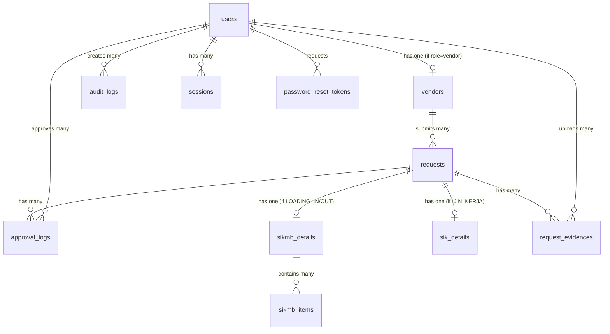

# Database Schema - Mall Approval System
## Entity Relationship Diagram (ERD)

**Version:** 2.0  
**Last Updated:** 2026-05-01

---

## 📊 ERD Overview



---

## 📋 Table Definitions

### **Phase 1: Authentication Module** ✅

#### 1. users
**Purpose:** Menyimpan semua user sistem (Super Admin, Vendor, Approver, Security)

| Column | Type | Constraints | Description |
|--------|------|-------------|-------------|
| id | BIGINT UNSIGNED | PK, AUTO_INCREMENT | Primary key |
| email | VARCHAR(255) | UNIQUE, NOT NULL | Email login |
| password | VARCHAR(255) | NOT NULL | Hashed password (bcrypt) |
| role | ENUM | NOT NULL | 'super_admin', 'vendor', 'approver_dept', 'approver_ops', 'approver_finance', 'approver_gm', 'security' |
| is_active | BOOLEAN | DEFAULT TRUE | Status aktif user |
| email_verified_at | TIMESTAMP | NULL | Waktu verifikasi email |
| remember_token | VARCHAR(100) | NULL | Token "Remember Me" |
| created_at | TIMESTAMP | DEFAULT CURRENT_TIMESTAMP | Waktu dibuat |
| updated_at | TIMESTAMP | ON UPDATE CURRENT_TIMESTAMP | Waktu diupdate |

**Indexes:**
- PRIMARY KEY (id)
- UNIQUE KEY (email)
- INDEX (role)
- INDEX (is_active)

**Business Rules:**
- Email harus unique di seluruh sistem
- Password minimal 8 karakter, di-hash dengan bcrypt
- Role tidak bisa diubah setelah user dibuat (untuk audit trail)
- is_active = FALSE untuk soft delete user

---

#### 2. vendors
**Purpose:** Menyimpan data perusahaan vendor (1 user vendor = 1 record vendor)

| Column | Type | Constraints | Description |
|--------|------|-------------|-------------|
| id | BIGINT UNSIGNED | PK, AUTO_INCREMENT | Primary key |
| user_id | BIGINT UNSIGNED | FK, UNIQUE, NOT NULL | Reference ke users.id |
| company_name | VARCHAR(255) | NOT NULL | Nama perusahaan/PT |
| pic_name | VARCHAR(255) | NOT NULL | Nama penanggung jawab |
| pic_phone | VARCHAR(20) | NOT NULL | No HP PIC |
| address | TEXT | NOT NULL | Alamat lengkap perusahaan |
| created_at | TIMESTAMP | DEFAULT CURRENT_TIMESTAMP | Waktu dibuat |
| updated_at | TIMESTAMP | ON UPDATE CURRENT_TIMESTAMP | Waktu diupdate |

**Indexes:**
- PRIMARY KEY (id)
- UNIQUE KEY (user_id)
- INDEX (company_name)

**Foreign Keys:**
- user_id REFERENCES users(id) ON DELETE CASCADE

**Business Rules:**
- Hanya user dengan role='vendor' yang punya record di tabel ini
- 1 user = 1 vendor (UNIQUE constraint pada user_id)
- Data vendor auto-fill saat submit surat
- Jika user dihapus, vendor record juga terhapus (CASCADE)

---

#### 3. audit_logs
**Purpose:** Mencatat semua aktivitas user untuk audit trail

| Column | Type | Constraints | Description |
|--------|------|-------------|-------------|
| id | BIGINT UNSIGNED | PK, AUTO_INCREMENT | Primary key |
| user_id | BIGINT UNSIGNED | FK, NULL | Reference ke users.id |
| user_email | VARCHAR(255) | NOT NULL | Email user (backup jika user dihapus) |
| user_role | VARCHAR(50) | NOT NULL | Role user saat action |
| action | VARCHAR(100) | NOT NULL | Jenis aksi (LOGIN, LOGOUT, CREATE_USER, dll) |
| details | TEXT | NULL | JSON data dengan context tambahan |
| ip_address | VARCHAR(45) | NULL | IP address user |
| user_agent | TEXT | NULL | Browser/device info |
| created_at | TIMESTAMP | DEFAULT CURRENT_TIMESTAMP | Waktu aksi |

**Indexes:**
- PRIMARY KEY (id)
- INDEX (user_id)
- INDEX (action)
- INDEX (created_at)

**Foreign Keys:**
- user_id REFERENCES users(id) ON DELETE SET NULL

**Business Rules:**
- Log bersifat immutable (tidak bisa diupdate/delete)
- Jika user dihapus, user_id jadi NULL tapi email tetap tersimpan
- details berisi JSON untuk context tambahan (contoh: {"old_role": "vendor", "new_role": "security"})

**Action Types:**
- `LOGIN` - User berhasil login
- `FAILED_LOGIN` - Login gagal
- `LOGOUT` - User logout
- `REGISTER` - Vendor self-registration
- `CREATE_USER` - Super admin create user
- `UPDATE_USER` - Super admin update user
- `DEACTIVATE_USER` - Super admin deactivate user
- `PASSWORD_RESET` - User reset password
- `SUBMIT_REQUEST` - Vendor submit surat (Phase 2)
- `APPROVE_REQUEST` - Approver approve surat (Phase 2)
- `REJECT_REQUEST` - Approver reject surat (Phase 2)

---

#### 4. password_reset_tokens
**Purpose:** Menyimpan token untuk reset password

| Column | Type | Constraints | Description |
|--------|------|-------------|-------------|
| email | VARCHAR(255) | PK | Email user yang request reset |
| token | VARCHAR(255) | NOT NULL | Hashed token |
| created_at | TIMESTAMP | DEFAULT CURRENT_TIMESTAMP | Waktu token dibuat |

**Indexes:**
- PRIMARY KEY (email)
- INDEX (token)

**Business Rules:**
- Token valid selama 60 menit
- 1 email hanya bisa punya 1 token aktif (PRIMARY KEY)
- Token di-hash sebelum disimpan (security)
- Token dihapus setelah berhasil reset password

---

#### 5. sessions
**Purpose:** Menyimpan session user yang login

| Column | Type | Constraints | Description |
|--------|------|-------------|-------------|
| id | VARCHAR(255) | PK | Session ID |
| user_id | BIGINT UNSIGNED | FK, NULL | Reference ke users.id |
| ip_address | VARCHAR(45) | NULL | IP address user |
| user_agent | TEXT | NULL | Browser/device info |
| payload | LONGTEXT | NOT NULL | Session data (encrypted) |
| last_activity | INT | NOT NULL | Unix timestamp last activity |

**Indexes:**
- PRIMARY KEY (id)
- INDEX (user_id)
- INDEX (last_activity)

**Business Rules:**
- Session timeout: 2 jam inactivity
- Session dihapus saat logout
- Session otomatis expired jika last_activity > 2 jam

---

### **Phase 2: Request Management Module** 🚧

#### 6. requests
**Purpose:** Tabel induk untuk semua surat (SIK & SIKMB)

| Column | Type | Constraints | Description |
|--------|------|-------------|-------------|
| id | BIGINT UNSIGNED | PK, AUTO_INCREMENT | Primary key |
| vendor_id | BIGINT UNSIGNED | FK, NOT NULL | Reference ke vendors.id |
| request_type | ENUM | NOT NULL | 'LOADING_IN', 'LOADING_OUT', 'IJIN_KERJA' |
| status | ENUM | DEFAULT 'DRAFT' | Status surat (lihat State Machine) |
| sop_form_code | VARCHAR(50) | NULL | Kode form (SM-ICB/001) |
| document_serial_no | VARCHAR(50) | UNIQUE, NULL | No seri form (001518) |
| original_form_image | VARCHAR(500) | NULL | Link foto form fisik di R2 |
| qr_code | VARCHAR(500) | NULL | Link QR code di R2 (generated after APPROVED) |
| cancelled_reason | TEXT | NULL | Alasan cancel (jika status=CANCELLED) |
| created_at | TIMESTAMP | DEFAULT CURRENT_TIMESTAMP | Waktu dibuat |
| updated_at | TIMESTAMP | ON UPDATE CURRENT_TIMESTAMP | Waktu diupdate |
| deleted_at | TIMESTAMP | NULL | Soft delete timestamp |

**Indexes:**
- PRIMARY KEY (id)
- UNIQUE KEY (document_serial_no)
- INDEX (vendor_id)
- INDEX (status)
- INDEX (request_type)
- INDEX (created_at)

**Foreign Keys:**
- vendor_id REFERENCES vendors(id) ON DELETE RESTRICT

**Status State Machine:**
```
DRAFT → SUBMITTED → PENDING_DEPT → PENDING_OPS → PENDING_FINANCE → PENDING_GM → APPROVED
                         ↓              ↓              ↓               ↓
                     REJECTED       REJECTED       REJECTED        REJECTED
                     
SUBMITTED/PENDING_* → CANCELLED (by vendor)
APPROVED → EXECUTED (after security scan)
```

**Business Rules:**
- document_serial_no harus unique (1 form fisik = 1 surat)
- QR code hanya di-generate setelah status=APPROVED
- Soft delete: deleted_at != NULL (tidak hard delete)
- Vendor hanya bisa cancel surat dengan status SUBMITTED atau PENDING_*

---

#### 7. sikmb_details
**Purpose:** Detail surat SIKMB (Surat Izin Keluar/Masuk Barang)

| Column | Type | Constraints | Description |
|--------|------|-------------|-------------|
| id | BIGINT UNSIGNED | PK, AUTO_INCREMENT | Primary key |
| request_id | BIGINT UNSIGNED | FK, UNIQUE, NOT NULL | Reference ke requests.id |
| origin_floor | VARCHAR(50) | NULL | Lantai asal barang |
| origin_unit | VARCHAR(100) | NULL | Unit/toko asal barang |
| start_date | DATE | NOT NULL | Tanggal mulai angkut |
| end_date | DATE | NOT NULL | Tanggal selesai angkut |
| start_time | TIME | NOT NULL | Jam mulai (22:00) |
| end_time | TIME | NOT NULL | Jam selesai (05:00) |
| dest_address | TEXT | NOT NULL | Alamat tujuan lengkap |
| dest_floor | VARCHAR(50) | NULL | Lantai tujuan |
| dest_phone | VARCHAR(20) | NOT NULL | No HP penerima barang |
| created_at | TIMESTAMP | DEFAULT CURRENT_TIMESTAMP | Waktu dibuat |
| updated_at | TIMESTAMP | ON UPDATE CURRENT_TIMESTAMP | Waktu diupdate |

**Indexes:**
- PRIMARY KEY (id)
- UNIQUE KEY (request_id)
- INDEX (start_date)

**Foreign Keys:**
- request_id REFERENCES requests(id) ON DELETE CASCADE

**Business Rules:**
- Hanya ada jika request_type = 'LOADING_IN' atau 'LOADING_OUT'
- end_date >= start_date
- Jika request dihapus, detail juga terhapus (CASCADE)

---

#### 8. sikmb_items
**Purpose:** Daftar barang dalam surat SIKMB (relasi 1-to-Many)

| Column | Type | Constraints | Description |
|--------|------|-------------|-------------|
| id | BIGINT UNSIGNED | PK, AUTO_INCREMENT | Primary key |
| sikmb_detail_id | BIGINT UNSIGNED | FK, NOT NULL | Reference ke sikmb_details.id |
| item_name | VARCHAR(255) | NOT NULL | Nama barang |
| quantity | INT | NOT NULL | Jumlah barang |
| unit | VARCHAR(50) | NOT NULL | Satuan (kotak, pcs, dus, dll) |
| remarks | TEXT | NULL | Keterangan tambahan |
| created_at | TIMESTAMP | DEFAULT CURRENT_TIMESTAMP | Waktu dibuat |
| updated_at | TIMESTAMP | ON UPDATE CURRENT_TIMESTAMP | Waktu diupdate |

**Indexes:**
- PRIMARY KEY (id)
- INDEX (sikmb_detail_id)

**Foreign Keys:**
- sikmb_detail_id REFERENCES sikmb_details(id) ON DELETE CASCADE

**Business Rules:**
- 1 SIKMB bisa punya banyak items
- quantity harus > 0
- unit bisa custom (tidak fixed enum)

---

#### 9. sik_details
**Purpose:** Detail surat SIK (Surat Izin Kerja)

| Column | Type | Constraints | Description |
|--------|------|-------------|-------------|
| id | BIGINT UNSIGNED | PK, AUTO_INCREMENT | Primary key |
| request_id | BIGINT UNSIGNED | FK, UNIQUE, NOT NULL | Reference ke requests.id |
| worker_count | INT | NOT NULL | Jumlah tenaga kerja |
| start_date | DATE | NOT NULL | Tanggal mulai kerja |
| end_date | DATE | NOT NULL | Tanggal selesai kerja |
| start_time | TIME | NOT NULL | Jam mulai kerja |
| end_time | TIME | NOT NULL | Jam selesai kerja |
| location | VARCHAR(255) | NOT NULL | Lokasi kerja (Toilet Lt. GF) |
| job_type | VARCHAR(255) | NOT NULL | Jenis pekerjaan (Instalasi Listrik) |
| description | TEXT | NULL | Keterangan/permit khusus (Hot Work Permit) |
| created_at | TIMESTAMP | DEFAULT CURRENT_TIMESTAMP | Waktu dibuat |
| updated_at | TIMESTAMP | ON UPDATE CURRENT_TIMESTAMP | Waktu diupdate |

**Indexes:**
- PRIMARY KEY (id)
- UNIQUE KEY (request_id)
- INDEX (start_date)

**Foreign Keys:**
- request_id REFERENCES requests(id) ON DELETE CASCADE

**Business Rules:**
- Hanya ada jika request_type = 'IJIN_KERJA'
- worker_count harus > 0
- end_date >= start_date
- Security akan cocokkan worker_count dengan jumlah pekerja di lapangan

---

#### 10. approval_logs
**Purpose:** Audit trail untuk setiap step approval (immutable)

| Column | Type | Constraints | Description |
|--------|------|-------------|-------------|
| id | BIGINT UNSIGNED | PK, AUTO_INCREMENT | Primary key |
| request_id | BIGINT UNSIGNED | FK, NOT NULL | Reference ke requests.id |
| approver_id | BIGINT UNSIGNED | FK, NULL | Reference ke users.id (NULL jika vendor submit) |
| approver_role | VARCHAR(50) | NOT NULL | Role yang melakukan aksi |
| action | ENUM | NOT NULL | 'SUBMITTED', 'APPROVED', 'REJECTED', 'CANCELLED' |
| from_status | VARCHAR(50) | NULL | Status sebelum aksi |
| to_status | VARCHAR(50) | NULL | Status setelah aksi |
| notes | TEXT | NULL | Alasan approve/reject |
| action_date | TIMESTAMP | DEFAULT CURRENT_TIMESTAMP | Waktu aksi |

**Indexes:**
- PRIMARY KEY (id)
- INDEX (request_id)
- INDEX (action_date)

**Foreign Keys:**
- request_id REFERENCES requests(id) ON DELETE CASCADE
- approver_id REFERENCES users(id) ON DELETE SET NULL

**Business Rules:**
- Log bersifat immutable (tidak bisa diupdate/delete)
- Setiap perubahan status harus tercatat di sini
- notes wajib diisi jika action='REJECTED'

**Example Flow:**
```
1. Vendor submit → action=SUBMITTED, from_status=DRAFT, to_status=PENDING_DEPT, approver_role=vendor
2. Dept approve → action=APPROVED, from_status=PENDING_DEPT, to_status=PENDING_OPS, approver_role=approver_dept
3. Ops approve → action=APPROVED, from_status=PENDING_OPS, to_status=PENDING_FINANCE, approver_role=approver_ops
4. Finance reject → action=REJECTED, from_status=PENDING_FINANCE, to_status=REJECTED, approver_role=approver_finance, notes="Vendor ada tunggakan"
```

---

#### 11. request_evidences
**Purpose:** Menyimpan foto evidence dari Security di lapangan

| Column | Type | Constraints | Description |
|--------|------|-------------|-------------|
| id | BIGINT UNSIGNED | PK, AUTO_INCREMENT | Primary key |
| request_id | BIGINT UNSIGNED | FK, NOT NULL | Reference ke requests.id |
| uploaded_by | BIGINT UNSIGNED | FK, NOT NULL | Reference ke users.id (Security) |
| evidence_type | ENUM | NOT NULL | 'SECURITY_LOADING_IN', 'SECURITY_LOADING_OUT', 'SIK_WORK_PROOF' |
| image_url | VARCHAR(500) | NOT NULL | Link foto di R2 |
| notes | TEXT | NULL | Catatan Security |
| uploaded_at | TIMESTAMP | DEFAULT CURRENT_TIMESTAMP | Waktu upload |

**Indexes:**
- PRIMARY KEY (id)
- INDEX (request_id)
- INDEX (uploaded_at)

**Foreign Keys:**
- request_id REFERENCES requests(id) ON DELETE CASCADE
- uploaded_by REFERENCES users(id) ON DELETE SET NULL

**Business Rules:**
- Hanya user dengan role='security' yang bisa upload
- Foto wajib diupload setelah scan QR code
- 1 request bisa punya banyak foto evidence

---

## 🔄 Data Flow Examples

### Example 1: Vendor Self-Registration
```sql
-- Step 1: Create user
INSERT INTO users (email, password, role) 
VALUES ('vendor@example.com', '$2y$12$...', 'vendor');

-- Step 2: Create vendor record
INSERT INTO vendors (user_id, company_name, pic_name, pic_phone, address)
VALUES (1, 'PT Example', 'John Doe', '081234567890', 'Jl. Example No. 1');

-- Step 3: Log audit
INSERT INTO audit_logs (user_id, user_email, user_role, action, ip_address)
VALUES (1, 'vendor@example.com', 'vendor', 'REGISTER', '192.168.1.1');
```

### Example 2: Super Admin Create Approver
```sql
-- Step 1: Create user
INSERT INTO users (email, password, role) 
VALUES ('finance@mall.com', '$2y$12$...', 'approver_finance');

-- Step 2: Log audit
INSERT INTO audit_logs (user_id, user_email, user_role, action, details, ip_address)
VALUES (1, 'admin@mall.com', 'super_admin', 'CREATE_USER', 
        '{"created_user_email": "finance@mall.com", "created_user_role": "approver_finance"}', 
        '192.168.1.1');
```

### Example 3: Vendor Submit SIKMB (Phase 2)
```sql
-- Step 1: Create request
INSERT INTO requests (vendor_id, request_type, status, document_serial_no)
VALUES (1, 'LOADING_IN', 'SUBMITTED', '001518');

-- Step 2: Create SIKMB details
INSERT INTO sikmb_details (request_id, start_date, end_date, start_time, end_time, dest_address, dest_phone)
VALUES (1, '2026-05-10', '2026-05-10', '22:00', '05:00', 'Jl. Tujuan No. 1', '081234567890');

-- Step 3: Create SIKMB items
INSERT INTO sikmb_items (sikmb_detail_id, item_name, quantity, unit)
VALUES 
(1, 'Meja Kayu', 5, 'unit'),
(1, 'Kursi Plastik', 20, 'unit');

-- Step 4: Log approval
INSERT INTO approval_logs (request_id, approver_id, approver_role, action, from_status, to_status)
VALUES (1, 1, 'vendor', 'SUBMITTED', 'DRAFT', 'PENDING_DEPT');
```

---

## 📊 Database Statistics (Estimated)

### Storage Estimates (1 Year Operation)

| Table | Rows/Year | Avg Row Size | Total Size |
|-------|-----------|--------------|------------|
| users | 500 | 500 bytes | 250 KB |
| vendors | 400 | 1 KB | 400 KB |
| audit_logs | 50,000 | 500 bytes | 25 MB |
| password_reset_tokens | 100 (active) | 300 bytes | 30 KB |
| sessions | 200 (active) | 2 KB | 400 KB |
| requests | 10,000 | 1 KB | 10 MB |
| sikmb_details | 7,000 | 500 bytes | 3.5 MB |
| sikmb_items | 35,000 | 300 bytes | 10.5 MB |
| sik_details | 3,000 | 500 bytes | 1.5 MB |
| approval_logs | 40,000 | 400 bytes | 16 MB |
| request_evidences | 15,000 | 300 bytes | 4.5 MB |

**Total Database Size (1 Year):** ~72 MB (excluding images in R2)

---

## 🔐 Security Considerations

### 1. Sensitive Data Protection
- **passwords:** Always hashed with bcrypt (cost 12)
- **password_reset_tokens:** Token di-hash sebelum disimpan
- **sessions.payload:** Encrypted by Laravel

### 2. Soft Delete Strategy
- **requests:** Gunakan deleted_at untuk soft delete
- **users:** Gunakan is_active=FALSE untuk deactivate
- **audit_logs:** Never delete (immutable)

### 3. Foreign Key Constraints
- **CASCADE:** Jika parent dihapus, child juga terhapus (vendors, sikmb_details, sik_details)
- **SET NULL:** Jika parent dihapus, FK jadi NULL tapi record tetap ada (audit_logs, approval_logs)
- **RESTRICT:** Tidak bisa hapus parent jika masih ada child (requests → vendors)

---

## 📝 Migration Order

**Phase 1 Migrations (Authentication):**
1. `create_users_table`
2. `create_vendors_table`
3. `create_password_reset_tokens_table`
4. `create_sessions_table`
5. `create_audit_logs_table`

**Phase 2 Migrations (Request Management):**
6. `create_requests_table`
7. `create_sikmb_details_table`
8. `create_sikmb_items_table`
9. `create_sik_details_table`
10. `create_approval_logs_table`
11. `create_request_evidences_table`

---

**Document End**
