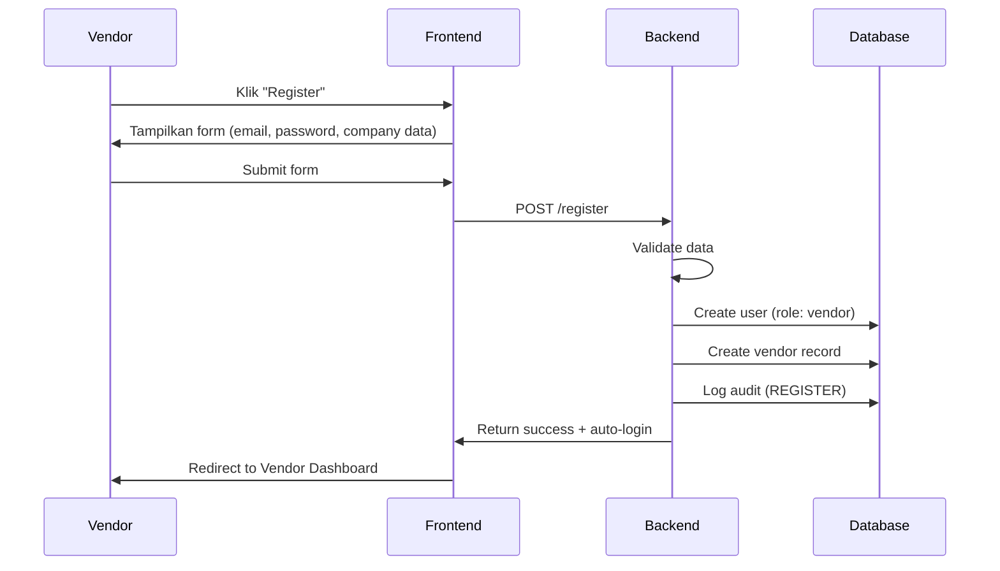
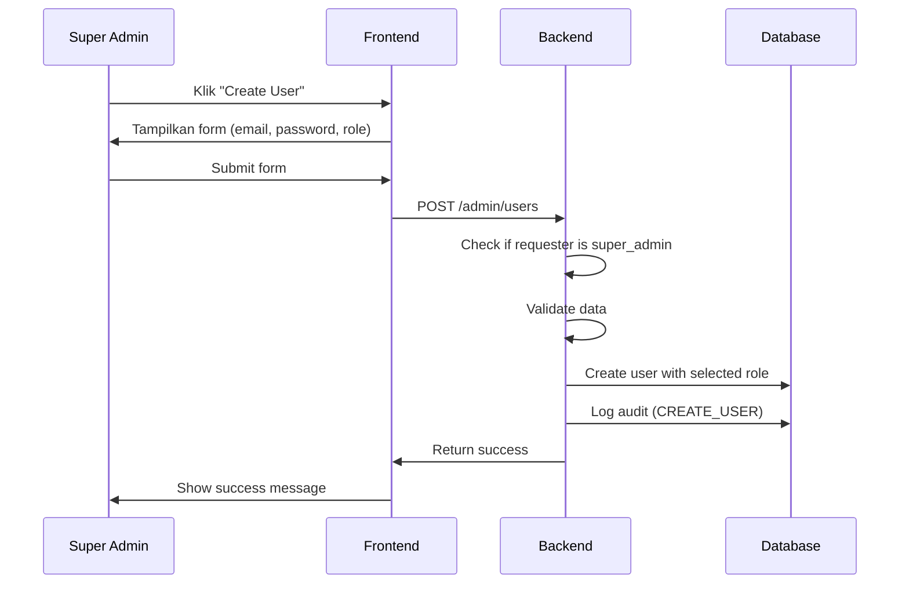
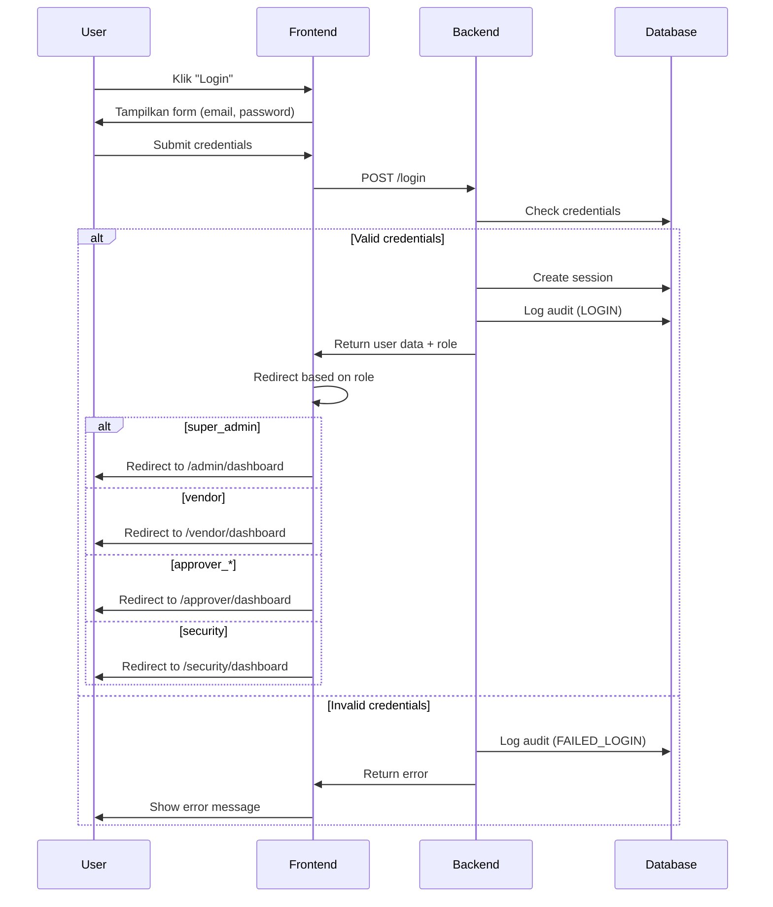
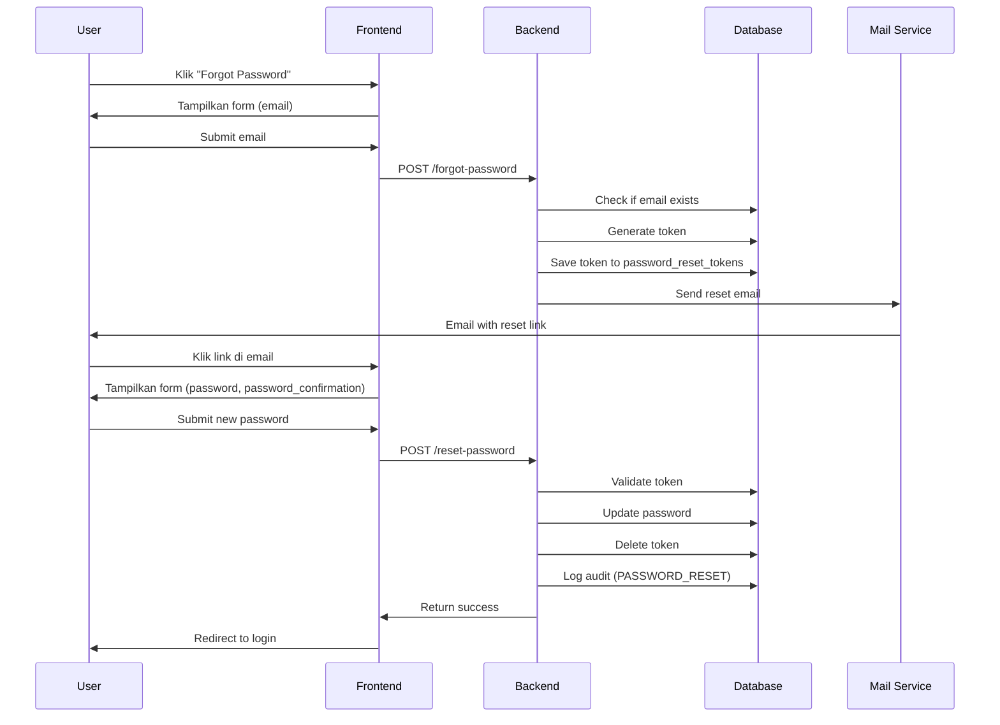

# Technical Specification - Mall Approval System
## Authentication & Authorization Module

**Version:** 2.0  
**Last Updated:** 2026-05-01  
**Status:** Foundation Phase

---

## 📋 Table of Contents

1. [System Overview](#system-overview)
2. [User Roles & Permissions](#user-roles--permissions)
3. [Database Schema](#database-schema)
4. [Authentication Flow](#authentication-flow)
5. [API Endpoints](#api-endpoints)
6. [UI/UX Specification](#uiux-specification)
7. [Security Considerations](#security-considerations)
8. [Future Enhancements](#future-enhancements)

---

## 1. System Overview

### 1.1 Purpose
Sistem approval digital untuk mengelola surat izin kerja (SIK) dan surat izin keluar/masuk barang (SIKMB) di mall dengan multi-level approval workflow.

### 1.2 Tech Stack
- **Backend:** Laravel 11 (PHP 8.2+)
- **Frontend:** React 18 + Inertia.js (JavaScript/JSX)
- **Database:** MySQL 8.0
- **Styling:** Tailwind CSS
- **Storage:** Cloudflare R2 (untuk foto/dokumen)
- **QR Code:** Laravel Simple QRCode
- **Containerization:** Docker + Docker Compose

### 1.3 Architecture
- **Pattern:** MVC + Service Layer
- **Authentication:** Laravel Sanctum (Session-based)
- **Authorization:** Role-based Access Control (RBAC)
- **State Management:** Inertia.js Shared Props

---

## 2. User Roles & Permissions

### 2.1 Role Hierarchy

```
SUPER_ADMIN (Level 0)
├── Manage all users
├── Manage system settings
└── Full access to all features

VENDOR (Level 1)
├── Self-registration
├── Submit surat (SIK/SIKMB)
├── View own submissions
├── Cancel pending submissions
└── View approval history

APPROVER_DEPT (Level 2)
├── View pending requests (PENDING_DEPT)
├── Approve/Reject with notes
└── View approval history

APPROVER_OPS (Level 3)
├── View pending requests (PENDING_OPS)
├── Approve/Reject with notes
└── View approval history

APPROVER_FINANCE (Level 4)
├── View pending requests (PENDING_FINANCE)
├── Approve/Reject with notes
├── Check vendor tunggakan
└── View approval history

APPROVER_GM (Level 5)
├── View pending requests (PENDING_GM)
├── Final approve/reject
└── View all requests

SECURITY (Level 6)
├── Scan QR Code
├── View approved requests
├── Upload evidence photos
└── Mark request as executed
```

### 2.2 Permission Matrix

| Feature | Super Admin | Vendor | Approver Dept | Approver Ops | Approver Finance | Approver GM | Security |
|---------|-------------|--------|---------------|--------------|------------------|-------------|----------|
| Create User | ✅ | ❌ | ❌ | ❌ | ❌ | ❌ | ❌ |
| Self Register | ❌ | ✅ | ❌ | ❌ | ❌ | ❌ | ❌ |
| Submit Surat | ❌ | ✅ | ❌ | ❌ | ❌ | ❌ | ❌ |
| Approve Level 1 | ✅ | ❌ | ✅ | ❌ | ❌ | ❌ | ❌ |
| Approve Level 2 | ✅ | ❌ | ❌ | ✅ | ❌ | ❌ | ❌ |
| Approve Level 3 | ✅ | ❌ | ❌ | ❌ | ✅ | ❌ | ❌ |
| Approve Level 4 | ✅ | ❌ | ❌ | ❌ | ❌ | ✅ | ❌ |
| Scan QR Code | ✅ | ❌ | ❌ | ❌ | ❌ | ❌ | ✅ |
| Upload Evidence | ✅ | ❌ | ❌ | ❌ | ❌ | ❌ | ✅ |
| View All Requests | ✅ | ❌ | ❌ | ❌ | ❌ | ✅ | ❌ |
| View Own Requests | ✅ | ✅ | ❌ | ❌ | ❌ | ❌ | ❌ |
| Cancel Request | ✅ | ✅ | ❌ | ❌ | ❌ | ❌ | ❌ |

---

## 3. Database Schema

### 3.1 Core Tables

#### **users**
```sql
CREATE TABLE users (
    id BIGINT UNSIGNED AUTO_INCREMENT PRIMARY KEY,
    email VARCHAR(255) UNIQUE NOT NULL,
    password VARCHAR(255) NOT NULL,
    role ENUM(
        'super_admin',
        'vendor',
        'approver_dept',
        'approver_ops',
        'approver_finance',
        'approver_gm',
        'security'
    ) NOT NULL,
    is_active BOOLEAN DEFAULT TRUE,
    email_verified_at TIMESTAMP NULL,
    remember_token VARCHAR(100) NULL,
    created_at TIMESTAMP DEFAULT CURRENT_TIMESTAMP,
    updated_at TIMESTAMP DEFAULT CURRENT_TIMESTAMP ON UPDATE CURRENT_TIMESTAMP,
    
    INDEX idx_email (email),
    INDEX idx_role (role),
    INDEX idx_is_active (is_active)
) ENGINE=InnoDB DEFAULT CHARSET=utf8mb4 COLLATE=utf8mb4_unicode_ci;
```

#### **vendors**
```sql
CREATE TABLE vendors (
    id BIGINT UNSIGNED AUTO_INCREMENT PRIMARY KEY,
    user_id BIGINT UNSIGNED UNIQUE NOT NULL,
    company_name VARCHAR(255) NOT NULL,
    pic_name VARCHAR(255) NOT NULL COMMENT 'Person In Charge Name',
    pic_phone VARCHAR(20) NOT NULL,
    address TEXT NOT NULL,
    created_at TIMESTAMP DEFAULT CURRENT_TIMESTAMP,
    updated_at TIMESTAMP DEFAULT CURRENT_TIMESTAMP ON UPDATE CURRENT_TIMESTAMP,
    
    FOREIGN KEY (user_id) REFERENCES users(id) ON DELETE CASCADE,
    INDEX idx_company_name (company_name)
) ENGINE=InnoDB DEFAULT CHARSET=utf8mb4 COLLATE=utf8mb4_unicode_ci;
```

#### **audit_logs**
```sql
CREATE TABLE audit_logs (
    id BIGINT UNSIGNED AUTO_INCREMENT PRIMARY KEY,
    user_id BIGINT UNSIGNED NULL,
    user_email VARCHAR(255) NOT NULL,
    user_role VARCHAR(50) NOT NULL,
    action VARCHAR(100) NOT NULL COMMENT 'LOGIN, LOGOUT, CREATE_USER, SUBMIT_REQUEST, etc',
    details TEXT NULL COMMENT 'JSON data with additional context',
    ip_address VARCHAR(45) NULL,
    user_agent TEXT NULL,
    created_at TIMESTAMP DEFAULT CURRENT_TIMESTAMP,
    
    FOREIGN KEY (user_id) REFERENCES users(id) ON DELETE SET NULL,
    INDEX idx_user_id (user_id),
    INDEX idx_action (action),
    INDEX idx_created_at (created_at)
) ENGINE=InnoDB DEFAULT CHARSET=utf8mb4 COLLATE=utf8mb4_unicode_ci;
```

#### **password_reset_tokens**
```sql
CREATE TABLE password_reset_tokens (
    email VARCHAR(255) PRIMARY KEY,
    token VARCHAR(255) NOT NULL,
    created_at TIMESTAMP DEFAULT CURRENT_TIMESTAMP,
    
    INDEX idx_token (token)
) ENGINE=InnoDB DEFAULT CHARSET=utf8mb4 COLLATE=utf8mb4_unicode_ci;
```

#### **sessions**
```sql
CREATE TABLE sessions (
    id VARCHAR(255) PRIMARY KEY,
    user_id BIGINT UNSIGNED NULL,
    ip_address VARCHAR(45) NULL,
    user_agent TEXT NULL,
    payload LONGTEXT NOT NULL,
    last_activity INT NOT NULL,
    
    INDEX idx_user_id (user_id),
    INDEX idx_last_activity (last_activity)
) ENGINE=InnoDB DEFAULT CHARSET=utf8mb4 COLLATE=utf8mb4_unicode_ci;
```

### 3.2 Future Tables (Phase 2+)

#### **requests** (Tabel Induk Surat)
```sql
CREATE TABLE requests (
    id BIGINT UNSIGNED AUTO_INCREMENT PRIMARY KEY,
    vendor_id BIGINT UNSIGNED NOT NULL,
    request_type ENUM('LOADING_IN', 'LOADING_OUT', 'IJIN_KERJA') NOT NULL,
    status ENUM(
        'DRAFT',
        'SUBMITTED',
        'PENDING_DEPT',
        'PENDING_OPS',
        'PENDING_FINANCE',
        'PENDING_GM',
        'APPROVED',
        'REJECTED',
        'CANCELLED',
        'EXECUTED'
    ) DEFAULT 'DRAFT',
    sop_form_code VARCHAR(50) NULL COMMENT 'SM-ICB/001',
    document_serial_no VARCHAR(50) UNIQUE NULL COMMENT '001518',
    original_form_image VARCHAR(500) NULL COMMENT 'Link to R2',
    qr_code VARCHAR(500) NULL COMMENT 'Generated after APPROVED',
    cancelled_reason TEXT NULL,
    created_at TIMESTAMP DEFAULT CURRENT_TIMESTAMP,
    updated_at TIMESTAMP DEFAULT CURRENT_TIMESTAMP ON UPDATE CURRENT_TIMESTAMP,
    deleted_at TIMESTAMP NULL COMMENT 'Soft delete',
    
    FOREIGN KEY (vendor_id) REFERENCES vendors(id),
    INDEX idx_status (status),
    INDEX idx_request_type (request_type),
    INDEX idx_created_at (created_at)
) ENGINE=InnoDB DEFAULT CHARSET=utf8mb4 COLLATE=utf8mb4_unicode_ci;
```

#### **approval_logs** (Audit Trail Approval)
```sql
CREATE TABLE approval_logs (
    id BIGINT UNSIGNED AUTO_INCREMENT PRIMARY KEY,
    request_id BIGINT UNSIGNED NOT NULL,
    approver_id BIGINT UNSIGNED NULL,
    approver_role VARCHAR(50) NOT NULL,
    action ENUM('SUBMITTED', 'APPROVED', 'REJECTED', 'CANCELLED') NOT NULL,
    from_status VARCHAR(50) NULL,
    to_status VARCHAR(50) NULL,
    notes TEXT NULL COMMENT 'Alasan reject/approve',
    action_date TIMESTAMP DEFAULT CURRENT_TIMESTAMP,
    
    FOREIGN KEY (request_id) REFERENCES requests(id) ON DELETE CASCADE,
    FOREIGN KEY (approver_id) REFERENCES users(id) ON DELETE SET NULL,
    INDEX idx_request_id (request_id),
    INDEX idx_action_date (action_date)
) ENGINE=InnoDB DEFAULT CHARSET=utf8mb4 COLLATE=utf8mb4_unicode_ci;
```

---

## 4. Authentication Flow

### 4.1 Vendor Self-Registration



**Validation Rules:**
- Email: required, email format, unique
- Password: required, min 8 characters, confirmed
- Company Name: required, max 255 characters
- PIC Name: required, max 255 characters
- PIC Phone: required, numeric, min 10 digits
- Address: required, max 500 characters

### 4.2 Super Admin Create User



**Validation Rules:**
- Email: required, email format, unique
- Password: required, min 8 characters
- Role: required, one of allowed roles
- Only super_admin can create users

### 4.3 Login Flow (All Roles)



### 4.4 Password Reset Flow



---

## 5. API Endpoints

### 5.1 Authentication Endpoints

| Method | Endpoint | Description | Auth Required | Role |
|--------|----------|-------------|---------------|------|
| GET | `/login` | Show login page | No | - |
| POST | `/login` | Process login | No | - |
| POST | `/logout` | Logout user | Yes | All |
| GET | `/register` | Show registration page | No | - |
| POST | `/register` | Process vendor registration | No | - |
| GET | `/forgot-password` | Show forgot password page | No | - |
| POST | `/forgot-password` | Send reset link | No | - |
| GET | `/reset-password/{token}` | Show reset password page | No | - |
| POST | `/reset-password` | Process password reset | No | - |

### 5.2 Super Admin Endpoints

| Method | Endpoint | Description | Auth Required | Role |
|--------|----------|-------------|---------------|------|
| GET | `/admin/dashboard` | Super admin dashboard | Yes | super_admin |
| GET | `/admin/users` | List all users | Yes | super_admin |
| GET | `/admin/users/create` | Show create user form | Yes | super_admin |
| POST | `/admin/users` | Create new user | Yes | super_admin |
| GET | `/admin/users/{id}/edit` | Show edit user form | Yes | super_admin |
| PUT | `/admin/users/{id}` | Update user | Yes | super_admin |
| DELETE | `/admin/users/{id}` | Deactivate user | Yes | super_admin |

### 5.3 Dashboard Endpoints (Phase 1)

| Method | Endpoint | Description | Auth Required | Role |
|--------|----------|-------------|---------------|------|
| GET | `/vendor/dashboard` | Vendor dashboard (placeholder) | Yes | vendor |
| GET | `/approver/dashboard` | Approver dashboard (placeholder) | Yes | approver_* |
| GET | `/security/dashboard` | Security dashboard (placeholder) | Yes | security |

### 5.4 Rate Limiting

- **Login:** 5 attempts per minute per IP
- **Password Reset:** 3 requests per hour per email
- **Registration:** 10 registrations per hour per IP

---

## 6. UI/UX Specification

### 6.1 Page Structure

#### **Guest Pages**
1. **Login Page** (`/login`)
   - Email input
   - Password input
   - Remember me checkbox
   - "Forgot Password?" link
   - "Register as Vendor" link
   - Submit button

2. **Register Page** (`/register`)
   - Email input
   - Password input
   - Password confirmation input
   - Company name input
   - PIC name input
   - PIC phone input
   - Address textarea
   - "Already have account? Login" link
   - Submit button

3. **Forgot Password Page** (`/forgot-password`)
   - Email input
   - "Back to Login" link
   - Submit button

4. **Reset Password Page** (`/reset-password/{token}`)
   - Password input
   - Password confirmation input
   - Submit button

#### **Authenticated Pages (Phase 1)**

1. **Super Admin Dashboard** (`/admin/dashboard`)
   - Header with user info & logout
   - Sidebar navigation:
     - Dashboard
     - Manage Users
     - Audit Logs
     - Settings
   - Main content:
     - Statistics cards (total users by role)
     - Recent activities
     - Quick actions (Create User button)

2. **Vendor Dashboard** (`/vendor/dashboard`)
   - Header with company name, user info & logout
   - Main content:
     - Placeholder text: "Dashboard Vendor"
     - (Phase 2: Submit surat, view submissions)

3. **Approver Dashboard** (`/approver/dashboard`)
   - Header with role name, user info & logout
   - Main content:
     - Placeholder text: "Dashboard Approval - [Role Name]"
     - (Phase 2: Pending requests, approval history)

4. **Security Dashboard** (`/security/dashboard`)
   - Header with user info & logout
   - Main content:
     - Placeholder text: "Dashboard Security"
     - (Phase 2: QR scanner, evidence upload)

### 6.2 Component Library

**Reusable Components:**
- `Button` - Primary, Secondary, Danger variants
- `Input` - Text, Email, Password, Number, Textarea
- `Select` - Dropdown with search
- `Alert` - Success, Error, Warning, Info
- `Modal` - Confirmation dialogs
- `Table` - Data tables with pagination
- `Card` - Content containers
- `Badge` - Status indicators

### 6.3 Color Scheme

```css
/* Primary Colors */
--primary: #2563eb;      /* Blue - Main actions */
--secondary: #64748b;    /* Gray - Secondary actions */
--success: #10b981;      /* Green - Success states */
--danger: #ef4444;       /* Red - Danger/Delete */
--warning: #f59e0b;      /* Orange - Warnings */
--info: #3b82f6;         /* Light Blue - Info */

/* Role Colors */
--super-admin: #8b5cf6;  /* Purple */
--vendor: #10b981;       /* Green */
--approver: #3b82f6;     /* Blue */
--security: #f59e0b;     /* Orange */

/* Neutral Colors */
--gray-50: #f9fafb;
--gray-100: #f3f4f6;
--gray-900: #111827;
```

---

## 7. Security Considerations

### 7.1 Authentication Security

1. **Password Hashing**
   - Use bcrypt with cost factor 12
   - Never store plain text passwords

2. **Session Management**
   - Session timeout: 2 hours of inactivity
   - Secure cookie flags: HttpOnly, Secure (production)
   - CSRF protection on all POST/PUT/DELETE requests

3. **Rate Limiting**
   - Prevent brute force attacks
   - IP-based throttling
   - Email-based throttling for password reset

4. **Input Validation**
   - Server-side validation for all inputs
   - Sanitize user inputs to prevent XSS
   - Use prepared statements to prevent SQL injection

### 7.2 Authorization Security

1. **Role-Based Access Control**
   - Middleware checks on every protected route
   - Verify user role matches required role
   - Return 403 Forbidden if unauthorized

2. **Audit Trail**
   - Log all authentication events
   - Log all user management actions
   - Store IP address and user agent
   - Immutable logs (no updates/deletes)

### 7.3 Data Protection

1. **Sensitive Data**
   - Never expose password hashes in API responses
   - Mask sensitive vendor data in logs
   - Use HTTPS in production

2. **File Upload (Phase 2)**
   - Validate file types (images only)
   - Limit file size (max 5MB per file)
   - Scan for malware
   - Store in Cloudflare R2 with private access

---

## 8. Future Enhancements

### 8.1 Phase 2 Features
- Request submission (SIK/SIKMB)
- Multi-level approval workflow
- QR Code generation
- In-app notifications
- Approval delegation

### 8.2 Phase 3 Features
- OCR for form scanning
- Email/WhatsApp notifications
- PDF export
- Analytics dashboard
- Mobile app for Security

### 8.3 Phase 4 Features
- Auto-escalation for timeout approvals
- Template surat
- Bulk approval
- Advanced reporting
- Integration with mall management system

---

## 9. Development Guidelines

### 9.1 Coding Standards

**PHP (Laravel):**
- Komentar dalam Bahasa Indonesia
- Controller tipis (delegasi ke Service)
- Form Request untuk semua validasi
- Service layer untuk business logic
- Repository pattern untuk data access

**JavaScript (React):**
- Komentar dalam Bahasa Indonesia
- Komponen maksimal 200 baris
- Props terdokumentasi di komentar
- Custom hooks untuk reusable logic
- Functional components dengan hooks

### 9.2 Testing Strategy

**Unit Tests:**
- Service classes
- Helper functions
- Validation rules

**Feature Tests:**
- Authentication flows
- Authorization checks
- API endpoints

**Browser Tests:**
- Critical user journeys
- Cross-browser compatibility

### 9.3 Deployment

**Development:**
- Docker Compose
- Hot reload dengan Vite
- MySQL local

**Staging:**
- Docker on VPS
- MySQL RDS
- Cloudflare R2

**Production:**
- Kubernetes cluster
- MySQL RDS with replication
- Cloudflare R2 with CDN
- Redis for caching

---

## 10. Glossary

- **SIK:** Surat Izin Kerja (Work Permit)
- **SIKMB:** Surat Izin Keluar/Masuk Barang (Goods In/Out Permit)
- **PIC:** Person In Charge
- **OCR:** Optical Character Recognition
- **RBAC:** Role-Based Access Control
- **MVP:** Minimum Viable Product

---

**Document End**
